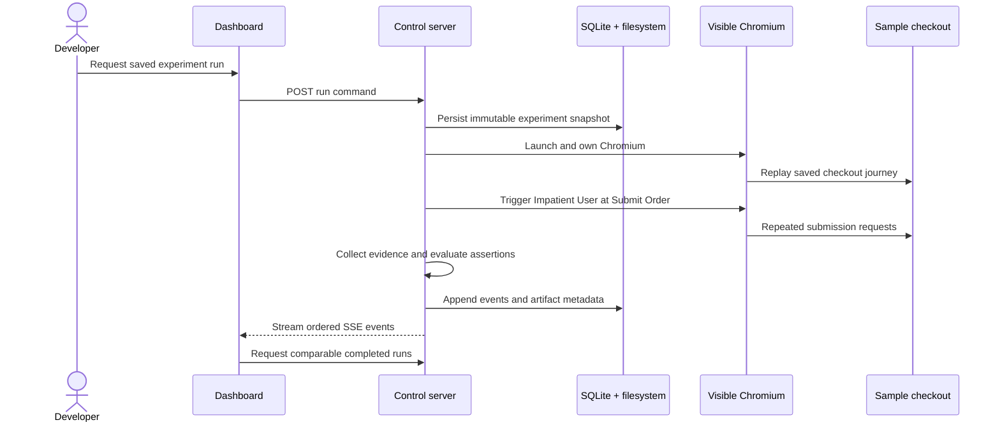

# Priority 0 data flow

The eventual submission-critical lifecycle is below. Chunk 3 implements the
API-driven browser core plus durable definitions, snapshots, events, assertions,
and screenshot artifacts. Dashboard control, SSE, and comparison remain deferred.

## Lifecycle responsibilities

1. **Dashboard requests a run — partially implemented.** `POST /api/sample-runs`
   accepts a target mode, but the dashboard does not call it yet.
2. **Server snapshots the saved experiment — implemented for the seed.** The
   persisted run receives journey steps, injector configuration, assertion
   configuration, selected mode, and target URL before Chromium launches.
3. **Server launches visible Chromium — implemented.** Only the server owns
   Playwright and uses a fresh context per run; tests override visible mode to
   headless.
4. **Runner executes journey steps — implemented for one hardcoded journey.**
   Steps execute in order and missing targets produce identified runner errors.
5. **Impatient User acts at Submit Order — implemented.** Two trigger attempts
   occur exactly 100 ms apart at the configured step.
6. **Evidence is collected — implemented for Priority 0.** Browser order-request
   metadata and sample test-support state are persisted, and full-page PNGs are
   attempted immediately before disruption, after both triggers, and after final
   state is read.
7. **Assertions are evaluated — implemented for one assertion.** Created-order
   count determines pass/fail; evidence failures remain runner errors.
8. **Events and artifacts are persisted — implemented.** Run events append under
   database-enforced per-run sequence rules. Artifact metadata points to validated
   server-owned relative files, includes SHA-256 integrity hashes, and never stores
   screenshot blobs in SQLite.
9. **Dashboard receives live events — not implemented.** One SSE stream per run
   carries versioned event envelopes after the REST command returns.
10. **Completed runs become comparable — not implemented.** Only runs of the same
    saved experiment can form the core failed-versus-fixed comparison.

REST is used for finite commands and queries. SSE is used for one-way ordered
progress because the MVP does not require bidirectional socket messaging.
