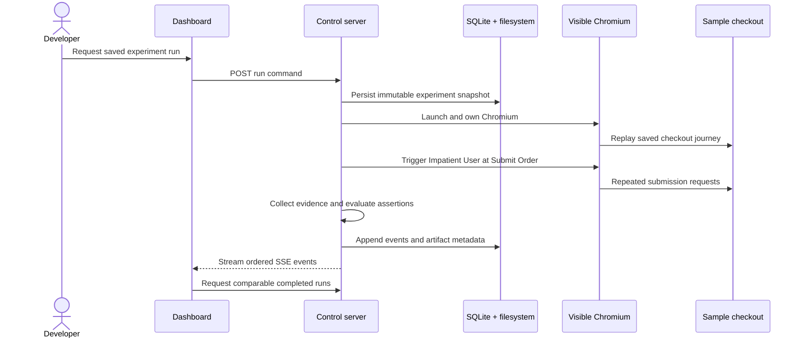

# Priority 0 data flow

The eventual submission-critical lifecycle is below. Chunk 0 implements only the
process boundaries, contracts, health endpoint, and runner interface; every
numbered runtime step remains **not implemented**.

## Lifecycle responsibilities

1. **Dashboard requests a run — not implemented.** A REST command will identify a
   saved experiment version and target mode.
2. **Server snapshots the saved experiment — not implemented.** The snapshot will
   include journey steps, injector configuration, assertion configuration, and
   relevant target settings so future edits cannot rewrite history.
3. **Server launches visible Chromium — not implemented.** Only the server owns
   Playwright and the browser lifecycle.
4. **Runner executes journey steps — not implemented.** Steps execute in saved
   order; a missing target terminates replay visibly rather than being skipped.
5. **Impatient User acts at Submit Order — not implemented.** The runner triggers
   the configured repeated action at the exact saved step with deterministic
   timing.
6. **Evidence is collected — not implemented.** Network observations and sample
   order records provide the Priority 0 duplicate evidence. Screenshots are later
   Priority 1 work according to the PRD.
7. **Assertions are evaluated — not implemented.** Each configured recovery
   assertion receives an independent result; runner errors do not become failed
   assertions.
8. **Events and artifacts are persisted — not implemented.** Run events append in
   order. Artifact metadata points to server-owned files rather than database
   blobs.
9. **Dashboard receives live events — not implemented.** One SSE stream per run
   carries versioned event envelopes after the REST command returns.
10. **Completed runs become comparable — not implemented.** Only runs of the same
    saved experiment can form the core failed-versus-fixed comparison.

REST is used for finite commands and queries. SSE is used for one-way ordered
progress because the MVP does not require bidirectional socket messaging.
