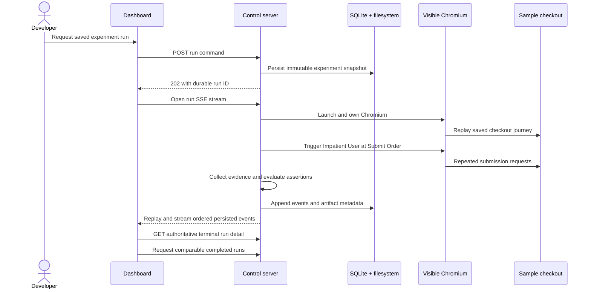
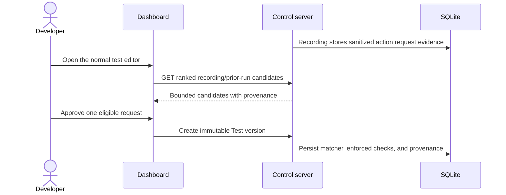

# Priority 0 data flow

The submission-critical lifecycle is below. Chunk 4 implements dashboard control,
durable asynchronous run acceptance, SSE replay/live publication, and persisted
single-run evidence. Failed-versus-fixed comparison remains deferred.

## Lifecycle responsibilities

1. **Dashboard requests a run — implemented for the sample.**
   `POST /api/sample-runs` accepts a target mode and returns `202` only after the
   run row and immutable snapshots exist. Chromium continues asynchronously.
2. **Server snapshots the saved experiment — implemented for the seed.** The
   persisted run receives journey steps, injector configuration, assertion
   configuration, selected mode, and target URL before Chromium launches.
3. **Server launches visible Chromium — implemented.** Only the server owns
   Playwright and uses a fresh context per run; tests override visible mode to
   headless.
4. **Runner executes journey steps — implemented for one hardcoded journey.**
   Steps execute in order and missing targets produce identified runner errors.
5. **Impatient User acts at Submit Order — implemented.** Two trigger attempts
   occur exactly 100 ms apart at the configured step.
6. **Evidence is collected — implemented for Priority 0.** Browser order-request
   metadata and sample test-support state are persisted, and full-page PNGs are
   attempted immediately before disruption, after both triggers, and after final
   state is read.
7. **Assertions are evaluated — implemented for one assertion.** Created-order
   count determines pass/fail; evidence failures remain runner errors.
8. **Events and artifacts are persisted — implemented.** Run events append under
   database-enforced per-run sequence rules. Artifact metadata points to validated
   server-owned relative files, includes SHA-256 integrity hashes, and never stores
   screenshot blobs in SQLite.
9. **Dashboard receives live events — implemented.** One SSE stream per run
   first replays SQLite events, then receives process-local publication only after
   each append succeeds. Persisted sequence IDs support `Last-Event-ID` resume;
   terminal events close the stream and trigger an authoritative detail reload.
10. **Completed runs become comparable — not implemented.** Only runs of the same
    saved experiment can form the core failed-versus-fixed comparison.

REST is used for finite commands and queries. SSE is used for one-way ordered
progress because the MVP does not require bidirectional socket messaging.

## External network-evidence approval flow

This standard flow performs no extra replay. Every matcher requires explicit
approval, and no-candidate results remain browser-only rather than inventing
network protection. The historical request-discovery command remains available
for backward compatibility outside the normal editor.

## External Outcome Check ownership

1. New test and Edit operations read the exact Journey version's approved
   Critical Action and complete Outcome Check list inside the version-creation
   transaction.
2. The server persists those records on the immutable external experiment
   version. Optional bounded browser checks are stored separately as custom
   technical assertions.
3. A Run copies the version-owned snapshot into the immutable Run before
   Chromium launches and evaluates only that snapshot.
4. Changes to the Journey's current Outcome Checks do not alter saved versions
   or historical Runs. Edit is the only operation that adopts them into a new
   version.
5. Outcome checks prove only their bounded browser-visible conditions. Hidden
   database records and unobserved backend effects remain explicitly unknown.
