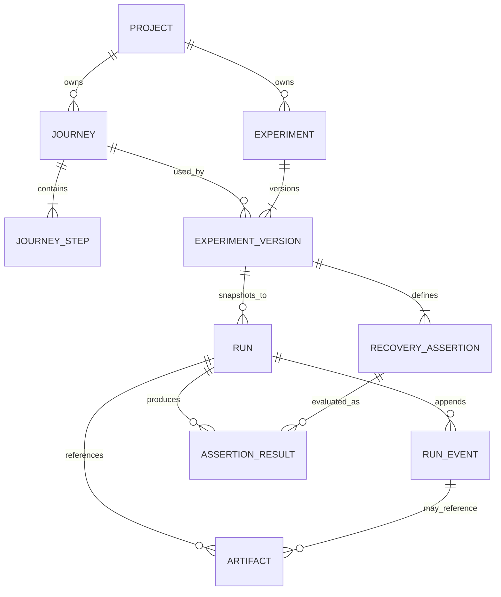

# Conceptual data model

This document describes the server-owned metadata model implemented in SQLite
through ordered SQL migrations. Identifiers are opaque
strings, timestamps are UTC, JSON is validated at repository boundaries, and
binary screenshots stay on disk.

## Critical Priority 0 fields

### Project

- `id`, `name`, `targetBaseUrl`, `description`, `createdAt`, `updatedAt`.
- Bundled-sample identity must be explicit rather than inferred from its name.
- External project execution settings persist variable declarations and bounded
  hook configuration, never runtime secret values.
- Authentication metadata stores only a relative storage-state path and capture
  timestamps. Cookie and local-storage contents remain in the server-owned file.

### Journey

- `id`, `projectId`, `name`, `version`, `definitionJson`, and `createdAt`.
- Priority 0 uses a seeded saved journey; recording is post-Priority-0.

Journey steps remain inside the immutable structured `definitionJson` for this
single seeded journey. A normalized journey-step table is deferred until editing
or recording creates a real query requirement.

### Experiment

- `id`, `projectId`, `journeyId`, `name`, `experimentType`, and `createdAt`.
- Stable identity groups replays and comparisons across immutable versions.
- Creating a new test always inserts a new Experiment and its Version 1. Names
  are unique within one journey; a duplicate is a `TEST_NAME_EXISTS` conflict,
  never an implicit version operation.

### ExperimentVersion

- `id`, `experimentId`, `version`, configuration JSON, journey snapshot JSON,
  custom-assertion snapshot JSON, Critical Action snapshot JSON, Outcome Check
  snapshot JSON, and `createdAt`.
- Selected journey-step identity and deterministic Impatient User configuration.
- Complete serialized journey, injector, assertion, and target configuration.
- `schemaVersion`, `createdAt`, and a content hash for diagnostic integrity.
- Editing is an explicit operation addressed by stable `experimentId`; it
  appends the next version without changing the test identity or executing a
  run. Reads accept historical version IDs for compatibility and resolve stable
  IDs to their latest version.
- Each newly saved version owns the journey's current Critical Action and all
  approved Outcome Checks. Runs never resolve those checks through the mutable
  journey tables. A later Outcome Check appears in an existing test only after
  Edit saves another version.
- `assertions_snapshot_json` contains only optional custom technical checks.
  Outcome-Check-derived duplicates are removed at the persistence boundary.

### Stable test read models

- Journey-level test lists group `ExperimentVersion` records by the owning
  `Experiment.id` and return only the latest version for configuration display.
- Each stable summary includes version and run counts plus the latest Run
  summary, so the Journey workspace never infers identity from a version ID.
- Stable test detail returns the latest configuration together with immutable
  version history and bounded run history. Historical version-ID reads resolve
  to the owning stable test for backward-compatible navigation.
- These are read models over the existing Experiment, ExperimentVersion, and Run
  relationships; Chunk 3 adds no tables and rewrites no historical data.

### RecoveryAssertion

- `id`, `experimentVersionId`, `type`, readable `description`.
- Type-specific expected value, target/request/record reference, and position.
- Priority 0 requires “no more than one resulting order” or its exact equivalent.

### Run

- `id`, `experimentVersionId`, `status`, `mode`, and `targetUrl`.
- Immutable journey, experiment, and assertion snapshot JSON columns.
- `createdAt`, `startedAt`, `completedAt`, `durationMs`, and error summary fields.
- The snapshot is copied at run creation; historical runs never resolve through
  mutable current experiment data.

### RunEvent

- `id`, `runId`, monotonically increasing `sequence`, `eventType`.
- `relativeTimestampMs`, `recordedAt`, `schemaVersion`, and JSON payload.
- Rows are append-only. Corrections are new events, not updates to prior events.

### AssertionResult

- `id`, `runId`, assertion snapshot/reference, `status`.
- Expected and observed values, plain-language summary, and evaluated timestamp.
- `not_evaluated` and `error` stay distinct from assertion `failed`.

### Artifact

- `id`, `runId`, `artifactType`, `label`, media type, capture sequence, metadata,
  relative filesystem path, byte size, SHA-256 checksum, and created timestamp.
  Screenshot bytes remain under `var/screenshots`, never as SQLite blobs.

## External experiment tables

The external execution path uses `external_experiments`, immutable
`external_experiment_versions`, `external_runs`, append-only
`external_run_events`, `external_assertion_results`, and `external_artifacts`.
The original Priority 0 sample tables retain their locked mode and assertion
constraints; forcing generic external data into them would break the seeded
sample contract. Both paths share ownership, locator, event-envelope, assertion
status, and artifact conventions.

An external run snapshots its project/journey/experiment names and definitions,
safe resolved values, trigger count, sanitized browser request observations,
runner error, warnings, assertions, and relative artifact metadata. It never
persists ephemeral secret values or raw HTTP hook headers/bodies.

External experiment versions may also snapshot bounded request-selection
provenance: discovery identity/time, recommendation outcome, selection mode,
selected candidate ID/score/confidence/reasons, recommended and selected
method/path/host matchers, and whether the user overrode a recommendation.
Versions created before migration 0005 retain `null` provenance. Request bodies,
response bodies, headers, cookies, authentication state, and runtime secrets are
not part of this snapshot.

Migration 0006 adds `assertion_selection_provenance_json` to immutable external
experiment versions. It stores one bounded entry per saved assertion plus honest
entries for disabled recommendations: recommendation ID, generated/modified/manual
origin, confidence, reason, explanation, default state, user action, and safe
evidence IDs. Versions created before migration 0006 load with an empty list.
The snapshot excludes raw HTML, arbitrary page text, query strings,
request/response bodies, cookies, authorization headers, authentication state,
and runtime secrets.

Migration 0014 adds immutable Critical Action and Outcome Check snapshots to
external experiment versions. It backfills every existing version from the
approved checks in effect at migration time and leaves historical Run snapshots
and results unchanged. Migration 0016 removes matching generated
`outcome-{checkId}` technical duplicates. Migration 0017 restores explicit null
fingerprint fields that SQLite merge-patch semantics removed from the 0014
backfill. Existing version immutability is restored before each repair completes.

Migration 0015 adds bounded recording request evidence to recording sessions and
immutable network-evidence approval provenance to external experiment versions.
Recording evidence contains only action identity, method, origin/host, pathname,
status/failure, bounded action-relative timing, occurrence count, and observation
time. Version provenance records whether the approved candidate came from the
original `recording` or an existing `prior_run`; request/response bodies,
headers, cookies, authorization, query strings, and secrets remain excluded.

## Implemented database enforcement

- Foreign keys are enabled on every connection.
- Experiment version numbers are unique within an experiment and version rows are
  immutable through triggers.
- Run snapshot columns cannot be updated after insertion.
- Run event IDs and `(run_id, sequence_number)` are unique; insertion must be the
  next sequence and update/delete triggers preserve append-only history.
- Run modes, run statuses, assertion statuses, artifact labels, and current
  Priority 0 types use practical `CHECK` constraints.
- Artifact paths are validated relative POSIX paths; byte sizes and SHA-256
  checksums support integrity checks while SQLite stores metadata only.

## Integrity and privacy rules

- The control server is the only process allowed to read or mutate this database.
- Run configuration snapshots and experiment versions are immutable after use.
- Events are append-only and ordered by server-assigned sequence, not client time.
- Artifact paths are relative, server-validated paths under `var/`.
- Passwords and manually sensitive inputs are stored as masked markers or named
  references to fake test inputs. Raw sensitive values do not enter events,
  snapshots, logs, screenshots where practical, or exports.
- Runtime values carry transitive sensitivity and source metadata in memory.
  Mixed templates and multi-stage values inherit sensitivity from every secret
  dependency. Only untainted values cross the persisted safe-snapshot boundary.
- The seeded sample journey and user-recorded external journeys share the
  `journeys` table but not the same public read model. Generic journey APIs
  require recording metadata; sample APIs load the explicit seeded definition.
