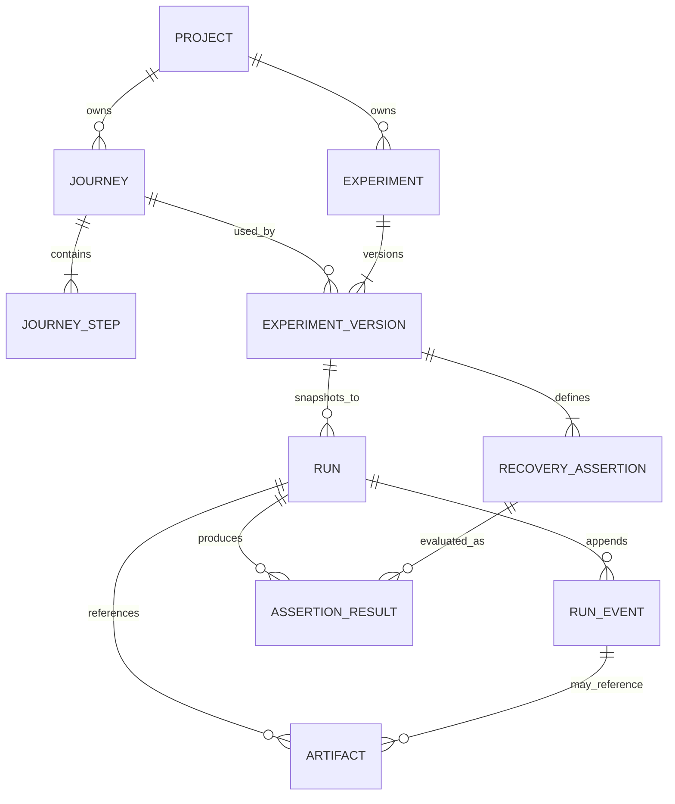

# Conceptual data model

This document designs the server-owned metadata model; Chunk 0 creates no SQLite
tables. Identifiers should be opaque strings, timestamps should be UTC, and
persisted configuration should carry an explicit schema version.

## Critical Priority 0 fields

### Project

- `id`, `name`, `targetBaseUrl`, `description`, `createdAt`, `updatedAt`.
- Bundled-sample identity must be explicit rather than inferred from its name.

### Journey

- `id`, `projectId`, `name`, `schemaVersion`, `createdAt`, `updatedAt`.
- Priority 0 uses a seeded saved journey; recording is post-Priority-0.

### JourneyStep

- `id`, `journeyId`, `position`, `actionType`, `targetSelector`, `pageUrl`.
- Action-specific configuration and a human-readable target description.
- Input uses a masked value or a test-data reference, never an exposed secret.

### Experiment

- `id`, `projectId`, `name`, `currentVersionId`, `createdAt`, `updatedAt`.
- Stable identity groups replays and comparisons across immutable versions.

### ExperimentVersion

- `id`, `experimentId`, `versionNumber`, `journeyId`, `experimentType`.
- Selected journey-step identity and deterministic Impatient User configuration.
- Complete serialized journey, injector, assertion, and target configuration.
- `schemaVersion`, `createdAt`, and a content hash for diagnostic integrity.

### RecoveryAssertion

- `id`, `experimentVersionId`, `type`, readable `description`.
- Type-specific expected value, target/request/record reference, and position.
- Priority 0 requires “no more than one resulting order” or its exact equivalent.

### Run

- `id`, `experimentId`, `experimentVersionId`, `status`, `targetMode`.
- Immutable `configurationSnapshot`, `snapshotSchemaVersion`, and snapshot hash.
- `createdAt`, `startedAt`, `completedAt`, `durationMs`, and error summary fields.
- The snapshot is copied at run creation; historical runs never resolve through
  mutable current experiment data.

### RunEvent

- `id`, `runId`, monotonically increasing `sequence`, `eventType`.
- `relativeTimestampMs`, `recordedAt`, `schemaVersion`, and JSON payload.
- Rows are append-only. Corrections are new events, not updates to prior events.

### AssertionResult

- `id`, `runId`, assertion snapshot/reference, `status`.
- Expected and observed values, plain-language summary, and evaluated timestamp.
- `not_evaluated` and `error` stay distinct from assertion `failed`.

### Artifact

- `id`, `runId`, optional `runEventId`, `kind`, `label`, media type.
- Relative filesystem path, byte size, checksum, created timestamp, and capture
  status. Screenshot bytes remain on disk under `var/screenshots`, never as SQLite
  blobs.

## Integrity and privacy rules

- The control server is the only process allowed to read or mutate this database.
- Run configuration snapshots and experiment versions are immutable after use.
- Events are append-only and ordered by server-assigned sequence, not client time.
- Artifact paths are relative, server-validated paths under `var/`.
- Passwords and manually sensitive inputs are stored as masked markers or named
  references to fake test inputs. Raw sensitive values do not enter events,
  snapshots, logs, screenshots where practical, or exports.
