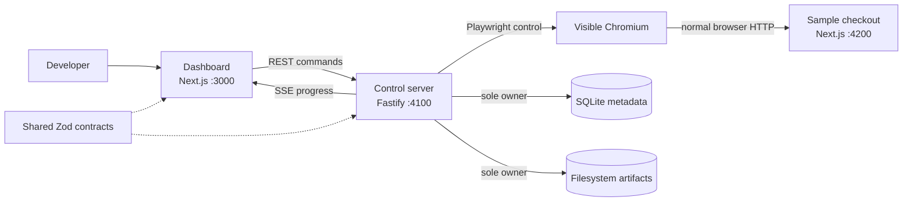

# Architecture overview

## Application boundaries

FormCrash Lab is a pnpm monorepo with three processes that can evolve and fail
independently while sharing explicit contracts.

1. **Dashboard (`apps/dashboard`)** — a Next.js user interface. It sends REST
   commands to the server and subscribes to Server-Sent Events (SSE). It does
   not own Playwright, SQLite, run orchestration, or evidence files.
2. **Control server (`apps/server`)** — a long-running Fastify modular monolith.
   It is the only process that launches visible Chromium, evaluates assertions,
   owns SQLite metadata, and writes or serves filesystem evidence.
3. **Bundled sample checkout (`apps/sample-checkout`)** — an independent Next.js
   target application. It exposes a realistic but fake controlled checkout for
   the guaranteed demonstration path and must remain usable without the control
   server.

## Why a modular monolith

Runs, events, persistence, browser ownership, assertions, and evidence share one
transactional lifecycle and one local operator. Splitting them across services
would introduce network failure modes, deployment work, and consistency problems
without helping Priority 0. Modules preserve business ownership inside a single
server process; they are not speculative service boundaries.

The server will permit one active browser run for the MVP. This makes exclusive
Chromium ownership and orderly shutdown explicit while preserving deterministic
demo behavior.

## Communication and ownership

The dashboard uses typed HTTP client modules. Command-style actions use REST;
ordered live run progress uses persisted replay plus process-local SSE publication.
The dashboard renders server-owned state
and never reads SQLite or artifacts by filesystem path.

External request discovery also returns server-owned ranked candidates and an
explicit recommendation outcome. The dashboard displays that evidence and may
persist the user's selection, but it does not recompute scores or silently select
ambiguous requests.

The sample checkout is separate because it is the system under test. Depending
on the control server would contaminate the experiment, hide real HTTP behavior,
and make the guaranteed demo path less representative.

## Sample and recorded journey entry points

The dashboard homepage exposes the seeded Sample Checkout runner directly.
`/projects` exposes the generic external-project recorder and experiment
workflow. These paths intentionally use separate current read models:

- Sample definitions are server-seeded and execute through the sample-run API,
  persisted sample runs, and sample SSE.
- Generic journey APIs expose only user-recorded journeys with recording
  metadata and execute through the external replay/experiment model.

The sample journey is not given fake recording metadata and is not forced through
the generic journey list. This preserves the distinction between a guaranteed
fixture and user-captured source material while keeping both workflows reachable
from the normal dashboard.

## Intentionally deferred

Chunks 1 through 6 now include the independent checkout, the seeded demonstration,
external project recording/replay, authenticated storage-state restoration,
runtime variables and controlled data hooks, plus persisted external Impatient
User experiments and server-owned request recommendation. Automatic assertion
expansion, reports, failed-versus-fixed comparison, other injectors, CI,
cross-browser execution, and cloud operation remain deferred.
