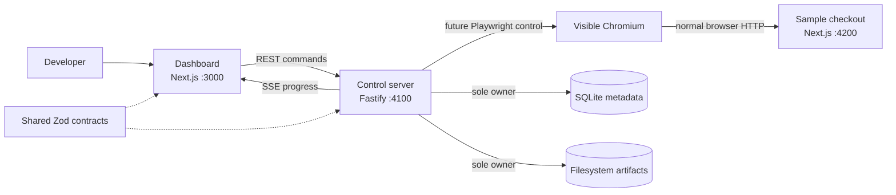

# Architecture overview

## Application boundaries

FormCrash Lab is a pnpm monorepo with three processes that can evolve and fail
independently while sharing explicit contracts.

1. **Dashboard (`apps/dashboard`)** — a Next.js user interface. It sends REST
   commands to the server and will subscribe to Server-Sent Events (SSE). It does
   not own Playwright, SQLite, run orchestration, or evidence files.
2. **Control server (`apps/server`)** — a long-running Fastify modular monolith.
   It is the only process that will launch visible Chromium, mutate FormCrash
   metadata, evaluate assertions, and write evidence.
3. **Bundled sample checkout (`apps/sample-checkout`)** — an independent Next.js
   target application. It exposes a realistic but fake controlled checkout for
   the guaranteed demonstration path and must remain usable without the control
   server.

## Why a modular monolith

Runs, events, persistence, browser ownership, assertions, and evidence share one
transactional lifecycle and one local operator. Splitting them across services
would introduce network failure modes, deployment work, and consistency problems
without helping Priority 0. Modules preserve business ownership inside a single
server process; they are not speculative service boundaries.

The server will permit one active browser run for the MVP. This makes exclusive
Chromium ownership and orderly shutdown explicit while preserving deterministic
demo behavior.

## Communication and ownership

The dashboard uses typed HTTP client modules. Command-style actions use REST;
ordered live run progress will use SSE. The dashboard renders server-owned state
and never reads SQLite or artifacts by filesystem path.

The sample checkout is separate because it is the system under test. Depending
on the control server would contaminate the experiment, hide real HTTP behavior,
and make the guaranteed demo path less representative.

## Intentionally deferred

Chunk 0 has no Playwright dependency, database schema, browser adapter, product
routes, SSE stream, checkout domain, recording, replay, injection, assertion,
evidence, screenshot, report, or comparison implementation. Those additions are
sequenced in the implementation roadmap so each slice is demonstrable and tested.
