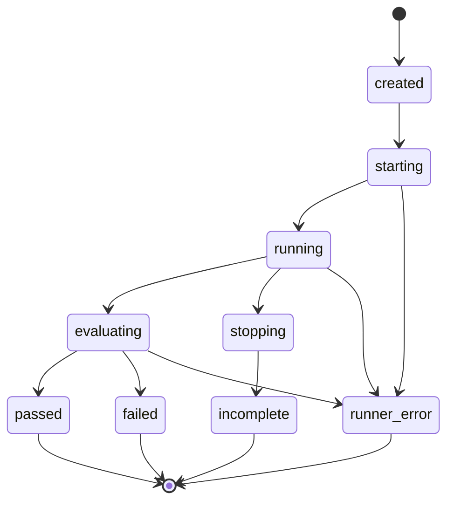

# Run state machine

Run state is server-owned. Transitions are explicit so the UI, persistence, and
runner cannot silently assign contradictory outcomes.

| Current state                                    | Allowed next states                      |
| ------------------------------------------------ | ---------------------------------------- |
| `created`                                        | `starting`                               |
| `starting`                                       | `running`, `runner_error`                |
| `running`                                        | `evaluating`, `stopping`, `runner_error` |
| `evaluating`                                     | `passed`, `failed`, `runner_error`       |
| `stopping`                                       | `incomplete`                             |
| `passed`, `failed`, `incomplete`, `runner_error` | none                                     |

Any transition not listed is invalid and must be rejected rather than coerced.
Terminal states are immutable. A stop request is valid only while running in the
bootstrap model; handling a stop during startup requires an explicit future
decision instead of silently inventing a transition.

`failed` means the run executed and at least one recovery assertion failed.
`runner_error` means FormCrash could not execute or evaluate the scenario, such
as Chromium failing to launch or a replay target being unavailable. Application
behavior and assertion failures must remain inspectable and must never be hidden
behind `runner_error` merely because the tested application behaved badly.
