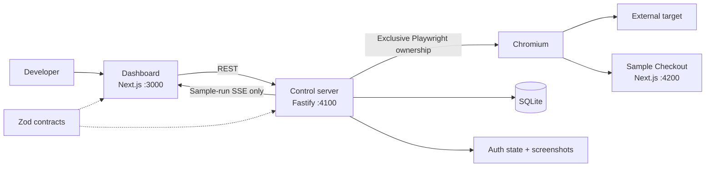

# FormCrash Lab current-state product and technical audit

**Audit date:** 2026-07-16  
**Branch:** `main`  
**Scope:** Repository and local runtime as inspected on the audit date  
**Change policy:** Report only; no product behavior, roadmap checkbox, commit, or push changes

> **Post-audit note:** Patch 0 was implemented after this point-in-time audit.
> The homepage/sample-entry and transitive-secret findings below describe the
> pre-patch state. Current behavior is documented in the root, dashboard, server,
> and architecture READMEs.
>
> **Post-audit note, Chunk 1:** Server-owned request recommendation was
> implemented after this point-in-time audit. Discovery now returns deterministic
> ranked candidates with confidence, reasons, explicit ambiguity/no-candidate
> outcomes, and experiment versions can persist bounded selection provenance.
> Historical findings below about dashboard-owned scoring remain unchanged as
> audit evidence.
>
> **Post-audit note, Chunk 2:** Server-owned automatic assertion recommendation
> was implemented after this point-in-time audit. Guided and Advanced now
> consume the same deterministic evidence-backed network/interface
> recommendations, and immutable experiment versions persist bounded generated,
> modified, disabled, and manual assertion provenance. Historical findings below
> about client-owned assertion generation remain unchanged as audit evidence.
>
> **Post-audit note, Product Chunk A:** Critical Actions and Outcome Checks are
> now owned by an exact saved journey-version UUID. Saving another version does
> not inherit either definition. Current Outcome Checks are immutable while
> present, but can be explicitly removed from the saved journey version; only
> after all current checks are removed can the Critical Action step change. A
> replacement is created through a fresh real baseline replay and approval, not
> general editing. Baseline capture reuses the existing environment
> classification, production confirmation, authentication, preparation hook,
> cleanup hook, and shared Chromium ownership gate. The dashboard warns that
> the replay can change target state and create test data, exposes server-owned
> generated-input/template provenance without persisting the resolved literal,
> and can recover an active capture after a dashboard refresh. Product Chunk B
> outcome execution has not started.

## Evidence legend

- **Observed in code** — confirmed by current implementation, schema, migration, or route code.
- **Proven by automated test** — exercised by an existing automated test that passed during this audit.
- **Observed through runtime verification** — confirmed against the locally running applications, API, SQLite database, or stored artifacts.
- **Documented only** — stated in documentation but not supported by current user-accessible implementation evidence.
- **Not verified** — source may exist, but the capability was not successfully exercised or visually inspected during this audit.

The audit treats user-facing availability separately from backend existence. A component, schema, helper, fixture, or database table is not counted as a completed product capability unless it is reachable through the current dashboard or a documented public API workflow.

---

## 1. Executive summary

FormCrash Lab is currently a local, three-process developer tool with two partly disconnected testing paths:

1. A strongly tested, hardcoded Sample Checkout duplicate-submission runner.
2. A generic external-project recorder, replay engine, and Impatient User experiment builder.

**Observed in code and through runtime verification:** The control server can launch Chromium, record supported same-tab actions, save versioned journeys, restore Playwright storage state, replay journeys, discover requests caused by a selected action, repeat a recorded click or submit, evaluate network and interface assertions, persist ordered events, and capture screenshots.

**Observed in code and proven by automated test:** The external workflow now includes a default Guided Test mode. It recommends the last submit or click, generates common identity values, ranks discovered requests, creates four network assertions, saves an immutable experiment version, runs it, and produces a deterministic plain-language diagnosis.

FormCrash can genuinely function today as:

| Product description               | Current assessment                                                                                                                                                                                                                      |
| --------------------------------- | --------------------------------------------------------------------------------------------------------------------------------------------------------------------------------------------------------------------------------------- |
| Sample demonstration              | The runner, API, target application, persisted evidence, and direct sample result route work. The normal homepage does not expose the one-click sample dashboard, so the demonstration is not complete as a first-run product workflow. |
| Browser recorder                  | Yes, for same-origin, top-frame navigation, click, fill, checkbox, radio, select, and submit actions. Unsupported actions generate warnings.                                                                                            |
| Visual test builder               | Yes, but only for the Impatient User repeated-action family. Guided mode reduces configuration; Advanced mode exposes the full matcher/assertion/hook builder.                                                                          |
| Usable resilience-testing product | Limited internal alpha. A technical developer can use it, but journey organization, test-data cleanup, result grouping, sample onboarding, and broader failure coverage are incomplete.                                                 |

The realistic current user is a frontend, full-stack, or QA engineer who understands test environments and can diagnose browser replay failures. Guided mode reduces HTTP knowledge, but it does not eliminate the need to understand authentication, test-data safety, cleanup, and ambiguous requests.

The strongest completed capability is deterministic duplicate-action execution with durable evidence. The sample path proves business-record duplication; the external path proves repeated browser requests and responses and can add interface assertions.

The largest product limitation is not the absence of AI. It is that FormCrash still lacks a coherent journey-centered product model and trustworthy automatic interpretation across arbitrary applications. External results usually prove requests and responses, not resulting business records, while cleanup and data repeatability remain the user's responsibility.

The most important next product change is a server-owned request recommendation and confidence model. Request discovery already exists, but recommendation is currently a dashboard-only heuristic. Moving ranking, reasons, confidence, and ambiguity handling into the durable server contract would remove a major technical decision without redesigning the product.

Important current-state contradictions:

- **Observed through runtime verification:** `/` renders the external project workspace and does not contain “Run Sample Experiment.”
- **Observed through runtime verification:** the seeded Sample Checkout project has zero journeys returned by `GET /api/projects/project-sample-checkout/journeys`.
- **Observed in code:** `SampleRunDashboard` exists and is tested but is not mounted by `apps/dashboard/src/app/page.tsx`.
- **Observed in code:** the root README describes the current external Guided Test workflow, while `apps/dashboard/README.md`, `apps/server/README.md`, and module READMEs still describe a sample-only or earlier product state.

---

## 2. Current application architecture

### Applications and packages

| Area                   | Current responsibility                                                                                                                                       | Evidence                                                                  |
| ---------------------- | ------------------------------------------------------------------------------------------------------------------------------------------------------------ | ------------------------------------------------------------------------- |
| `apps/dashboard`       | Next.js dashboard. Owns project, recording, Guided/Advanced experiment, external history, and sample result rendering. Does not import Playwright or SQLite. | Observed in code: `apps/dashboard/src/app`, `apps/dashboard/src/features` |
| `apps/server`          | Fastify control server. Sole owner of Chromium, SQLite, auth-state files, screenshots, runner orchestration, assertions, and sample SSE.                     | Observed in code: `apps/server/src/app/create-app.ts`                     |
| `apps/sample-checkout` | Independent fake checkout target with vulnerable and fixed duplicate behavior plus test-support APIs.                                                        | Proven by automated test: `apps/sample-checkout/test`                     |
| `packages/contracts`   | Zod schemas and inferred types for dashboard/server boundaries and persisted read models.                                                                    | Proven by automated test: `packages/contracts/test/schemas.test.ts`       |
| `packages/test-kit`    | Test-only builders. No production behavior.                                                                                                                  | Observed in code                                                          |
| `packages/config`      | Shared strict TypeScript configuration.                                                                                                                      | Observed in code                                                          |

### Runtime processes

`pnpm dev` runs:

- Dashboard on port 3000.
- Control server on port 4100.
- Sample checkout on port 4200.

The root `scripts/dev.mjs` launches each package as a child process and forwards prefixed output.

### Database and filesystem

- SQLite database: `var/database/formcrash.db`.
- SQLite uses WAL mode, foreign keys, a five-second busy timeout, and ordered checksum-protected migrations.
- Screenshots: `var/screenshots/<run-id>/`.
- Authentication state: `var/auth/<project-id>/storage-state.json`.
- `var/runs` and `var/exports` exist as reserved locations but have no implemented structured-run or export writer.
- Generated `var/*` content is ignored by Git.

### Browser ownership

One `BrowserOwnership` instance is shared by the sample runner, recorder, replay, authentication capture/validation, request discovery, and external experiment runner. It rejects concurrent workloads rather than queueing them.

### Communication

- Dashboard to server: REST using focused client modules and shared schemas.
- Server to dashboard: SSE only for the hardcoded sample-run path.
- External experiment execution is synchronous from the dashboard's perspective: `POST /api/external-experiments/:versionId/runs` waits for completion and returns the full result.
- Chromium interacts with targets through ordinary browser HTTP.
- Hooks execute through server-side `fetch`, not through the target browser.

### Concise architecture diagram



### Important module boundaries

- `modules/projects/routes.ts`: projects, recordings, journeys, replay, deletion.
- `modules/external-experiments/routes.ts`: settings, auth, discovery, experiment versions, external runs, external artifacts.
- `modules/runs`: hardcoded sample-run APIs and SSE.
- `runner/recording`: browser recorder and normal replay.
- `runner/external`: runtime templates, hooks, auth, discovery, assertions, and external experiment execution.
- `persistence`: separate repositories for sample runs, project/journey/settings, and external experiments.
- `artifacts/ScreenshotStore`: shared file staging, hashing, metadata creation, reads, and explicit deletion.

The sample and external execution models deliberately use parallel database tables and runners. They share contracts and infrastructure concepts, but they are not one unified scenario engine.

---

## 3. Current user-facing workflow

### 3.1 Starting FormCrash

- **User action:** install dependencies, install the server-owned Chromium binary, and run `pnpm dev`.
- **Automatic:** all three applications start; the server migrates SQLite and seeds sample definitions.
- **Manual decision:** environment variables, ports, headless mode, CORS origins, and storage paths only when defaults are unsuitable.
- **Technical knowledge:** medium.
- **Dashboard completeness:** complete for startup, assuming prerequisites are installed.
- **Common confusion:** `.env` files are not loaded automatically by the root launcher. The repository requires Node 24 and pnpm through Corepack.

### 3.2 Opening the bundled sample

- **User action:** open the dashboard.
- **Automatic:** the Sample Checkout project is seeded and protected from deletion.
- **Manual decision:** none should be required by the PRD.
- **Technical knowledge:** should be low.
- **Dashboard completeness:** incomplete.
- **Observed issue:** the homepage mounts `ProjectJourneyDashboard`, not `SampleRunDashboard`. The seeded sample journey has `recording_metadata_json = NULL`, and the generic journey repository filters it out. The user sees a Sample Checkout project with no recorded journeys and is directed toward recording rather than the saved one-click sample experiment.
- **Alternative:** a technical user can call `POST /api/sample-runs` and open `/runs/<runId>`, but that is not a first-run dashboard workflow.

### 3.3 Creating an external project

- **User action:** enter project name, target URL, environment, and optional description.
- **Automatic:** URL validation, persistence, selection, and settings loading.
- **Manual decision:** project identity and environment classification.
- **Technical knowledge:** low to medium.
- **Dashboard completeness:** complete.
- **Common confusion:** the UI defaults environment to `production`, including for localhost unless the user changes it. The server could infer local when environment is omitted, but the dashboard always sends an explicit selection.

### 3.4 Capturing authentication

- **User action:** open Advanced mode, click **Capture authentication**, sign in manually in visible Chromium, then click **I am signed in — save state**.
- **Automatic:** Chromium lifecycle, storage-state serialization, atomic file replacement, SQLite metadata, and future restoration.
- **Manual decision:** whether authentication is required and when the target is actually signed in.
- **Technical knowledge:** low for capture, medium for diagnosing expiry.
- **Dashboard completeness:** complete.
- **Common failure:** FormCrash cannot prove application-level authorization; validation only detects target-load failure or an obvious redirect to a login-like path.

### 3.5 Recording a journey

- **User action:** click **Start recording**, complete the journey in visible Chromium, then click **Stop recording**.
- **Automatic:** recorder injection before application scripts, supported event capture, input coalescing, navigation normalization, locator ranking, sensitive-field detection, warnings, and auth restoration.
- **Manual decision:** which successful path to record and which test data is safe.
- **Technical knowledge:** low to medium.
- **Dashboard completeness:** complete.
- **Common failures:** new tabs, iframes, file upload, CAPTCHA, third-party payments, drag/drop, contenteditable, and Shadow DOM are unsupported. Dynamic controls can still produce brittle locators.

### 3.6 Reviewing and saving a journey

- **User action:** name the journey; inspect/remove steps; rename steps; inspect locators; edit safe values; mark values sensitive; name required variables; save.
- **Automatic:** saved version number increments for the same project/name; cross-origin steps are rejected; password fields are forced sensitive.
- **Manual decision:** journey name, step quality, value safety, and locator acceptability.
- **Technical knowledge:** medium.
- **Dashboard completeness:** complete before save; there is no post-save rename/edit workflow.
- **Common confusion:** a captured sensitive value is discarded. The user must later provide its variable. Existing runtime data shows nine journeys all named “Towerdesk journey,” which is technically versioned but not easy to distinguish by intent.

### 3.7 Replaying a normal journey

- **User action:** supply unresolved runtime values, confirm production risk if applicable, and click **Replay**.
- **Automatic:** before hook, auth restoration, runtime/template validation, sequential replay, exact failed-step result, cleanup hook, and browser release.
- **Manual decision:** runtime values and production confirmation.
- **Technical knowledge:** medium when replay fails.
- **Dashboard completeness:** complete.
- **Common failure:** the replay result is not persisted as a journey-level health record. Cleanup failure during normal replay is swallowed and not surfaced.

### 3.8 Running request discovery

- **Guided user action:** click **Analyze action**.
- **Advanced user action:** select journey and target, then click **Discover requests**.
- **Automatic:** replay to the target, execute it once, collect requests, remove obvious static assets, group candidates, and sort mutating methods first.
- **Manual decision:** review or override the recommended request.
- **Technical knowledge:** low in Guided mode, high in Advanced mode.
- **Dashboard completeness:** complete.
- **Common risk:** discovery executes the real action once. Without cleanup it can create an extra record before the experiment even starts.

### 3.9 Creating an Impatient User experiment

- **Guided:** choose one of three repeated-action recipes, analyze, review the recommendation, accept/edit a name, and click **Save and run recommended test**.
- **Advanced:** choose journey, target step, name, two or three triggers, interval, continuation behavior, matcher, and assertions, then save.
- **Automatic:** immutable external experiment version and journey snapshot.
- **Manual decision:** substantially reduced in Guided mode but still includes target, recipe, request confirmation, naming, and cleanup.
- **Technical knowledge:** Guided medium; Advanced high.
- **Dashboard completeness:** complete for Impatient User only.

### 3.10 Configuring assertions

- **Guided:** four network assertions are generated automatically from the selected recipe and discovery response.
- **Advanced:** user adds up to 20 assertion drafts and selects types, values, and target steps.
- **Automatic:** type-specific validation and evaluation.
- **Manual decision:** Guided review/confirmation; Advanced full assertion design.
- **Technical knowledge:** low to medium in Guided; high in Advanced.
- **Dashboard completeness:** complete for current assertion types.
- **Common limitation:** no generic business-record count assertion exists for external applications.

### 3.11 Configuring runtime variables

- **User action:** in Advanced mode, declare names, mark secrets, optionally add templates, save settings, and provide unresolved values at replay/run time.
- **Automatic:** references are detected, unused declarations do not block, environment names are derived, templates are resolved before side effects, and safe built-ins generate unique values.
- **Manual decision:** declaration names, secret classification, template choice, and ephemeral values.
- **Technical knowledge:** medium to high.
- **Dashboard completeness:** complete.
- **Guided improvement:** common name/email/phone/identifier fields are automatically overridden with generated templates.

### 3.12 Configuring preparation and cleanup hooks

- **User action:** enable a hook, choose `POST` or `DELETE`, enter URL, headers JSON, and body JSON.
- **Automatic:** bounded timeout, template resolution, sanitized events, before-run failure classification, and cleanup warnings.
- **Manual decision:** endpoint, method, authorization, payload, and safety.
- **Technical knowledge:** high.
- **Dashboard completeness:** complete but manually authored.
- **Common failure:** invalid JSON editing silently retains the previous valid value. Cleanup verifies only an HTTP-success response, not resulting state.

### 3.13 Running an external experiment

- **User action:** click Run or Guided **Save and run**, provide runtime values, and confirm production when required.
- **Automatic:** preflight, before hook, auth restoration, prior-step replay, repeated target triggers, request observation, settling, assertions, screenshots, cleanup, persistence, and diagnosis.
- **Manual decision:** whether current data and cleanup are safe.
- **Technical knowledge:** medium.
- **Dashboard completeness:** complete but synchronous; no live external progress or stop control.
- **Common failure:** a long run leaves the dashboard waiting on one HTTP request. External run states include no `incomplete` or stopping workflow.

### 3.14 Inspecting results

- **Guided:** diagnosis first, actions next, then assertion and request details.
- **Advanced:** assertion-first result, matched request table, screenshots, and project-level persisted run history.
- **Automatic:** status, passed count, request status/duration, warnings, and screenshot links.
- **Manual decision:** determine whether repeated successes caused duplicate business records.
- **Technical knowledge:** medium.
- **Dashboard completeness:** partial.
- **Common issue:** external history cards omit journey name even though it is persisted. There is no external direct-result route or before/after comparison.

### 3.15 Inspecting screenshots and technical events

- **Screenshots:** user can view inline and open full size.
- **Technical events:** sample results render a collapsible timeline. External events are persisted and returned by API, but `ExternalRunResult` does not render them.
- **Dashboard completeness:** screenshots complete; external event inspection API-only.
- **Observed artifact issue:** the inspected external before screenshot clipped the modal's submit controls, and the after/final screenshots were nearly identical and did not visibly prove the duplicate records. Network assertions remained meaningful, but the visual evidence was weak.

---

## 4. Manual-work inventory

| Manual task                                          | Current classification                       | Automatable? | Safety confirmation? | Friction | Reason                                                                                      |
| ---------------------------------------------------- | -------------------------------------------- | ------------ | -------------------- | -------- | ------------------------------------------------------------------------------------------- |
| Project naming                                       | Required                                     | Partly       | No                   | Low      | A user-owned label is appropriate, but defaults could use host/app title.                   |
| Target URL entry                                     | Required                                     | No           | Yes for ownership    | Low      | FormCrash cannot safely infer the intended target.                                          |
| Environment classification                           | Required in UI                               | Partly       | Yes                  | Medium   | Default is production; incorrect classification changes confirmation behavior.              |
| Authentication capture                               | Optional but required for signed-in journeys | Partly       | Yes                  | High     | Requires manual sign-in and explicit confirmation; expiry remains possible.                 |
| Journey recording                                    | Required for external targets                | No           | Yes                  | Medium   | User must define the successful business path.                                              |
| Journey naming                                       | Required                                     | Highly       | No                   | Medium   | Current default is generic and runtime data demonstrates repeated indistinguishable names.  |
| Step naming                                          | Optional                                     | Highly       | No                   | Low      | Recorder supplies bounded names, but complex targets produce unusable text.                 |
| Locator review                                       | Advanced                                     | Partly       | No                   | High     | CSS and dynamic IDs require browser-automation knowledge.                                   |
| Removing noisy steps                                 | Optional                                     | Highly       | No                   | Medium   | Guided mode repairs only adjacent fills and duplicate navigation.                           |
| Runtime-variable creation                            | Required for unresolved values               | Highly       | No                   | High     | Users must understand declarations and naming rules.                                        |
| Runtime-variable provisioning                        | Required when unresolved                     | Partly       | Yes for secrets      | High     | Values must come from the run or environment and are easy to confuse with auth state.       |
| Test-value preparation                               | Required for repeatable data                 | Highly       | Yes                  | High     | Duplicate constraints make recorded static data fail on later runs.                         |
| Target-step selection                                | Required                                     | Highly       | Yes                  | Medium   | Guided recommends the last submit/click, but user should confirm business intent.           |
| Failure-recipe selection                             | Required                                     | Partly       | Yes                  | Low      | The user should choose the risk question; current choices are all repeated-action variants. |
| Trigger configuration                                | Advanced                                     | Highly       | No                   | Medium   | Guided recipes can hide count and interval.                                                 |
| Continuation choice                                  | Advanced                                     | Partly       | Yes                  | Medium   | Continuing can cause extra side effects or replay invalid post-submit steps.                |
| Request discovery                                    | Required for network assertions              | No           | Yes                  | High     | Executes the real action once and may create data.                                          |
| Request matcher selection                            | Required for network assertions              | Highly       | Yes                  | High     | Requires distinguishing the business request from background traffic.                       |
| Assertion creation                                   | Advanced; generated in Guided                | Highly       | Yes                  | High     | Technical users must translate recovery expectations into exact checks.                     |
| Assertion element selection                          | Required for UI/field assertions             | Partly       | Yes                  | High     | Depends on understanding recorded locators and final DOM state.                             |
| Before-run hook configuration                        | Optional/advanced                            | Partly       | Yes                  | High     | Requires endpoint, auth headers, body, and idempotent reset semantics.                      |
| Cleanup-hook configuration                           | Optional but strongly recommended            | Partly       | Yes                  | High     | Requires a target-specific deletion/reset API that many applications do not expose.         |
| Production confirmation                              | Required for production operations           | No           | Yes                  | Low      | Must remain explicit.                                                                       |
| Interpreting request versus business-record evidence | Required                                     | Partly       | No                   | High     | External runs prove request outcomes but not generic record creation.                       |
| Selecting runs for before/after analysis             | Not currently supported                      | Yes          | No                   | High     | Users can view history but cannot select or compare two runs.                               |
| Cleaning created application data                    | Required when hooks are absent/fail          | Partly       | Yes                  | High     | Guided discovery plus execution can create multiple records.                                |

Ten tasks above are rated high-friction and remain meaningful blockers in common external workflows: authentication, locator review, variable declaration, variable provisioning, test-data preparation, request discovery/matcher selection, assertion authoring/targeting, hook/cleanup authoring, result interpretation, and manual data cleanup.

---

## 5. Automation inventory

| Automated capability          | Scope and limitations                                                                                                                             | Arbitrary external app?           | Proof                                          | User-facing surface                          |
| ----------------------------- | ------------------------------------------------------------------------------------------------------------------------------------------------- | --------------------------------- | ---------------------------------------------- | -------------------------------------------- |
| Chromium lifecycle            | Fresh browser/context per workload; exclusive ownership; cleanup in `finally`. No queue.                                                          | Generic within supported pages    | Proven by server unit/integration tests        | Recording, replay, auth, discovery, runs     |
| Action recording              | Navigation, click, fill, checkbox, radio, select, submit. Same-tab/top-frame only.                                                                | Generic                           | Real Chromium fixture tests                    | Recording workspace                          |
| Input coalescing              | Replaces adjacent fills for the same serialized locator.                                                                                          | Generic                           | `recording-manager.test.ts`                    | Reflected in reviewed steps                  |
| Navigation normalization      | Omits immediate click/submit-caused navigation and duplicate navigation.                                                                          | Generic                           | Recorder code and integration tests            | Reflected in reviewed steps                  |
| Locator ranking               | `data-formcrash`, `data-testid`, stable ID, role/name, name, label, text, CSS. Repairs known generated IDs at replay.                             | Generic heuristic                 | Browser and locator tests                      | Locator shown in review                      |
| Sensitive detection           | Password and common secret/payment patterns; manual marking; sensitive value discarded.                                                           | Generic heuristic                 | Integration and persistence tests              | Review masking and variable field            |
| Authentication restoration    | Loads saved storage state for recording, replay, validation, discovery, and external run.                                                         | Generic                           | Auth integration tests                         | Advanced settings                            |
| Authentication validation     | Detects missing state, load failure, cross-origin redirect, or login-like path redirect.                                                          | Generic but shallow               | `auth-validation.test.ts`                      | Test authentication                          |
| Runtime requirement detection | Collects sensitive and `{{var.NAME}}` references; unused declarations do not block.                                                               | Generic                           | Runtime tests                                  | Replay and Guided fields                     |
| Safe template resolution      | Run IDs, timestamps, unique email/name/phone/text, and variables. Validates before side effects.                                                  | Generic                           | Runtime tests                                  | Advanced templates and Guided overrides      |
| Common field classification   | Name/email/phone/identifier heuristics from recorded fingerprints. Limited field vocabulary.                                                      | Generic heuristic                 | Guided model tests                             | Guided Test                                  |
| Request observation           | Captures method, origin, pathname, timing, status, failure; excludes bodies.                                                                      | Generic                           | Network tests and Chromium integration         | Results table/API                            |
| Request discovery             | Executes selected action once and returns grouped non-static candidates.                                                                          | Generic but fixture-proven        | External integration tests                     | Guided/Advanced                              |
| Request scoring               | Client-side mutation/status/path/time heuristic. Not persisted or server-authoritative.                                                           | Generic heuristic                 | Guided model/component tests                   | Guided recommendation                        |
| Failure injection             | Repeated click or submit: 2/3 triggers, 0/100/300 ms.                                                                                             | Generic for compatible targets    | External and sample integration tests          | Guided/Advanced                              |
| Assertion recommendations     | Four recipe-specific network checks. No interface or business-record recommendation.                                                              | Generic request-based heuristic   | Dashboard tests                                | Guided Test                                  |
| Assertion evaluation          | Seven network types plus visible/not-visible/disabled/text/field/final URL checks.                                                                | Generic browser/request semantics | Unit tests; fixture integration for subset     | Advanced builder/results                     |
| Deterministic diagnosis       | Client-side result branching based on matched requests, successes, 5xx, and runner status.                                                        | Generic but shallow               | Component tests and current UI code            | Guided result                                |
| Screenshot capture            | Three full-page PNGs, SHA-256, metadata, masked sensitive locators. Quality depends on target layout/timing.                                      | Generic                           | Store/runner tests; stored artifacts inspected | Results                                      |
| Event persistence             | Server-sequenced JSON events; update prevented; deletion allowed through explicit resource deletion.                                              | Both paths                        | Persistence tests                              | Sample timeline; external API only           |
| Run-state handling            | Full state machine for sample. External supports created/start/running/evaluating/terminal but no stop/incomplete.                                | Split                             | State and runner tests                         | Sample live result; external terminal result |
| Evidence persistence          | SQLite metadata and filesystem PNGs; sample and external parallel repositories.                                                                   | Both paths                        | Persistence/restart tests                      | History and result views                     |
| SSE replay                    | Persisted replay, sequence resume, heartbeat, terminal close. Sample only.                                                                        | Fixture-specific sample path      | SSE tests                                      | Sample `/runs/:runId`                        |
| Runner-error classification   | Separates browser/config/hook/persistence/journey failures from assertion failure.                                                                | Both paths                        | Runner tests                                   | Results                                      |
| Secret redaction              | Sensitive step values omitted; hook events exclude headers/body; safe snapshot excludes directly secret declarations. Derived-secret gap remains. | Generic                           | Security tests plus code review                | Public API/result                            |
| Cleanup execution             | Optional after hook executes after discovery/replay/run. Failure warning only for experiment; swallowed for normal replay.                        | Generic HTTP hook                 | Hook tests                                     | Advanced settings/result warning             |

---

## 6. Product object model

### Current persisted hierarchy

The external path does represent:

```text
Project
└── Journey
    └── External Experiment
        └── External Experiment Version
            └── External Run
```

The sample path separately represents:

```text
Seeded Project
└── Seeded Journey
    └── Seeded Experiment
        └── Seeded Experiment Version
            └── Sample Run
```

The requested collection model is not implemented:

```text
Project
└── Journey Collection
    └── Named Journey
        ├── Recommended experiments
        ├── Configured experiments
        └── Journey-level results
```

There is no journey collection, journey family ID, recommendation entity, coverage entity, health entity, or journey-level result resource.

| Object                       | Tables                                     | Public contract/API                        | Dashboard representation                                | Rename                | Versioning                               | Deletion and history                                                          |
| ---------------------------- | ------------------------------------------ | ------------------------------------------ | ------------------------------------------------------- | --------------------- | ---------------------------------------- | ----------------------------------------------------------------------------- |
| Project                      | `projects`                                 | `Project`; `/api/projects`                 | Project cards                                           | No edit/rename API    | No                                       | External projects can be force-deleted with all history; sample protected     |
| Recording session            | `recording_sessions`                       | `RecordingSession`; project recording APIs | Current recording only                                  | No                    | No                                       | Deleted with project; no list/history UI                                      |
| Journey                      | `journeys`                                 | `PersistedJourney`; project journey APIs   | Saved journey cards                                     | Only name before save | Version increments by same project/name  | Deleting a journey deletes experiments, runs, events, assertions, screenshots |
| External experiment identity | `external_experiments`                     | Not exposed independently                  | Implied by version cards                                | No                    | Versions grouped by project/journey/name | Removed when last version is deleted                                          |
| External experiment version  | `external_experiment_versions`             | `ExternalExperimentVersion`                | Version cards                                           | Immutable             | Yes                                      | Can be explicitly deleted with all referenced runs                            |
| External run                 | `external_runs` plus child evidence tables | `ExternalRunDetail/Summary`                | Project-level history                                   | No                    | Snapshot of experiment                   | Can be deleted individually                                                   |
| Sample experiment/version    | `experiments`, `experiment_versions`       | Sample read model                          | Not reachable from current homepage                     | No                    | Seeded v1                                | Protected indirectly by hidden sample journey/project                         |
| Sample run                   | `runs` plus child evidence tables          | `PersistedRunDetail/Summary`               | Direct `/runs/:id`; orphaned sample dashboard component | No                    | Immutable snapshot                       | No sample delete API                                                          |

### Naming and distinguishability

Journeys can be named “Add Tenant,” “Add Visitor,” or “Create Maintenance Request” if the user chooses those names during save. FormCrash does not infer those names, does not group versions into a visible collection, and does not permit rename after save.

**Observed through runtime verification:** the current database contains `Towerdesk journey` versions 1 through 9. That is valid versioning but poor product organization. External run history persists `journeyName`, yet the current history card displays only experiment name and status.

Guided experiment names use the recorded target step. A current runtime experiment name reached the 160-character limit because the recorded submit step inherited a large form text block. This demonstrates that automatic naming is present but not reliably useful.

### Historical integrity

- Experiment version rows and run snapshots cannot be updated.
- Event rows cannot be updated and must append in sequence.
- Migration 0004 intentionally permits deletion, and dashboard delete actions cascade through historical evidence.
- Therefore history is immutable while retained, not permanently append-only.

---

## 7. Feature inventory

### Foundations

| Capability                 | Status       | User-facing availability                                          | Backend                  | Persistence                                  | Tests                                     | Limitations and evidence                                               |
| -------------------------- | ------------ | ----------------------------------------------------------------- | ------------------------ | -------------------------------------------- | ----------------------------------------- | ---------------------------------------------------------------------- |
| Modular monorepo           | Complete     | Indirect                                                          | Complete                 | N/A                                          | Build/typecheck                           | Observed in package boundaries and ADR 0001                            |
| Sample checkout            | Complete     | Direct target URL; not exposed as one-click home workflow         | Complete                 | Process-local orders                         | 20 sample tests                           | Dashboard entry point disconnected                                     |
| Vulnerable and fixed modes | Complete     | Sample target and sample API                                      | Complete                 | Sample process memory; run results in SQLite | Concurrent route/store and Chromium tests | Fixed UI behavior lacks a focused component interaction test           |
| Visible Chromium runner    | Complete     | Recording/auth/replay/run                                         | Complete                 | Workload metadata                            | Chromium integration tests                | One workload at a time                                                 |
| SQLite persistence         | Complete     | Indirect                                                          | Complete                 | 20 tables including migrations               | Persistence/restart tests                 | Local single-user only                                                 |
| Screenshots                | Complete     | Sample and external results                                       | Complete                 | Files + metadata                             | Store/runner/UI tests                     | External screenshots can be visually ambiguous or clipped              |
| SSE                        | Fixture only | Sample direct run route only                                      | Complete for sample      | Replays `run_events`                         | SSE tests                                 | No external-run SSE                                                    |
| Run history                | Partial      | External project history; sample history component is not mounted | Complete                 | Both run tables                              | API/UI tests                              | External history not grouped by journey; no direct external result URL |
| Direct run result routes   | Partial      | `/runs/:runId` for sample only                                    | Sample read API complete | Yes                                          | Route/UI tests                            | No external dashboard route                                            |

### External application support

| Capability                  | Status   | User-facing availability                      | Backend  | Persistence                               | Tests                     | Limitations and evidence                      |
| --------------------------- | -------- | --------------------------------------------- | -------- | ----------------------------------------- | ------------------------- | --------------------------------------------- |
| User-created projects       | Complete | Yes                                           | Complete | `projects`                                | Route/UI tests            | No edit after creation                        |
| External URLs               | Complete | HTTP/HTTPS form                               | Complete | Project target URL                        | Contract/route tests      | Compatibility is not universal                |
| Authentication capture      | Complete | Advanced mode                                 | Complete | State file + metadata                     | Auth integration tests    | Manual confirmation; plaintext local state    |
| Session restoration         | Complete | Automatic                                     | Complete | Relative auth path                        | Integration tests         | Expiry detection is shallow                   |
| Journey recording           | Complete | Yes                                           | Complete | Session + journey JSON                    | Real Chromium tests       | Unsupported tabs/iframes/uploads/etc.         |
| Journey review              | Complete | Before save                                   | Complete | Reviewed snapshot                         | UI tests                  | No post-save editor                           |
| Journey naming              | Complete | Before save                                   | Complete | Name/version                              | UI/repository tests       | Default names are generic                     |
| Journey versioning          | Complete | Version shown                                 | Complete | Unique project/name/version               | Persistence tests         | No explicit lineage object beyond name        |
| Normal replay               | Complete | Saved journey cards                           | Complete | Result not persisted                      | Chromium tests            | No replay history/health                      |
| Exact failed-step reporting | Complete | Yes                                           | Complete | External run failed step; replay response | Unit/integration/UI tests | External failed-step URL is recorded as null  |
| Runtime variables           | Complete | Guided required fields; Advanced declarations | Complete | Declarations only; values ephemeral/env   | Runtime tests             | Naming/template concepts remain technical     |
| Generated values            | Partial  | Guided and Advanced templates                 | Complete | Safe resolved values                      | Model/runtime tests       | Limited heuristics and secret-derivation risk |
| Preparation hooks           | Complete | Advanced mode                                 | Complete | Hook config                               | Hook tests                | User-authored POST/DELETE only                |
| Cleanup hooks               | Partial  | Advanced mode and Guided warning              | Complete | Hook config/warnings                      | Hook tests                | No discovery, state verification, or retry    |

### Experiment support

| Capability                          | Status   | User-facing availability                  | Backend                           | Persistence                      | Tests                     | Limitations and evidence                                   |
| ----------------------------------- | -------- | ----------------------------------------- | --------------------------------- | -------------------------------- | ------------------------- | ---------------------------------------------------------- |
| External Impatient User             | Complete | Guided and Advanced                       | Complete                          | Versioned                        | Chromium integration      | Only failure injector implemented                          |
| Target-step compatibility           | Complete | Incompatible steps disabled               | Validated server-side             | Snapshot                         | Contract/route tests      | Click/submit only                                          |
| Request discovery                   | Complete | Guided and Advanced                       | Complete                          | Result not persisted             | Chromium integration      | Executes real action once                                  |
| Automatic request selection         | Partial  | Guided preselects client-scored candidate | No server recommendation contract | Not persisted                    | Dashboard tests           | User must review; heuristic can select background mutation |
| Manual request matching             | Complete | Advanced selection from discovery         | Complete                          | Version matcher                  | Contract/tests            | No arbitrary regex/body matching                           |
| Network assertions                  | Complete | Guided/Advanced                           | Complete                          | Snapshot/results                 | Unit/integration          | Request-based, not business-record based                   |
| Interface assertions                | Complete | Advanced                                  | Complete                          | Snapshot/results                 | Unit tests                | Target must remain in final DOM                            |
| Navigation assertions               | Complete | Advanced final URL contains/not contains  | Complete                          | Snapshot/results                 | Unit tests                | No browser-history assertions                              |
| Automatic assertion recommendations | Partial  | Four network checks per Guided recipe     | Client-generated                  | Persisted after save             | Dashboard tests           | No UI, field, or business-record recommendation            |
| Experiment versioning               | Complete | Version cards                             | Complete                          | Immutable while retained         | Persistence tests         | Versions and history can be deleted                        |
| Experiment result persistence       | Complete | External history/result                   | Complete                          | Runs/events/assertions/artifacts | Restart/integration tests | No external live stream/direct route                       |

### Product intelligence and usability

| Capability                        | Status      | User-facing availability                        | Backend                          | Persistence                 | Tests                                  | Limitations and evidence                                                |
| --------------------------------- | ----------- | ----------------------------------------------- | -------------------------------- | --------------------------- | -------------------------------------- | ----------------------------------------------------------------------- |
| Guided test wizard                | Partial     | Default external mode                           | Uses existing APIs               | Saves version/run           | Component tests and runtime guided run | Only repeated-action recipes; still requires cleanup and request review |
| Risky-action detection            | Partial     | Recommends last submit/click                    | Client-only                      | No                          | Model tests                            | Does not infer business operation or destructiveness                    |
| Recommended experiment suite      | Partial     | Three repeated-action recipes                   | One injector                     | Versions                    | Component tests                        | Not a multi-failure suite                                               |
| Generated safe test data          | Partial     | Common identity fields                          | Runtime templates                | Safe values may persist     | Tests                                  | Limited classifier; not schema-aware                                    |
| Cleanup assistant                 | Partial     | Warning and link to Advanced                    | Hook execution                   | Hook config                 | UI/hook tests                          | No automatic endpoint discovery or record deletion                      |
| Deterministic diagnosis           | Partial     | Guided result                                   | Client-only branching            | Not persisted as diagnosis  | Component test                         | Diagnosis uses requests/statuses, not business records                  |
| Plain-language result explanation | Partial     | Strong sample result; Guided external diagnosis | Read models support descriptions | Assertion text persisted    | UI tests                               | Advanced external result is still technical                             |
| Journey collections               | Not started | None                                            | None                             | None                        | None                                   | No collection table/contract/API                                        |
| Journey-level coverage            | Not started | None                                            | None                             | None                        | None                                   | Runs are project-level history                                          |
| Journey health checks             | Partial     | Static readiness score                          | Client-only                      | None                        | Model tests                            | Does not run a health replay or persist health                          |
| Basic mode                        | Partial     | Guided mode approximates basic mode             | Existing APIs                    | N/A                         | UI tests                               | Still exposes technical project/recording workspace                     |
| Advanced mode                     | Complete    | Tab in external workspace                       | Complete                         | Settings/version data       | UI tests                               | Dense, technical, single-page configuration                             |
| Failed-versus-fixed comparison    | Not started | None                                            | No comparison API                | No comparison entity        | None                                   | History exists but cannot compare                                       |
| Report export                     | Not started | None                                            | None                             | `var/exports` reserved only | None                                   | Documented target only                                                  |
| Playwright export                 | Not started | None                                            | None                             | `var/exports` reserved only | None                                   | Documented target only                                                  |

### Failure recipes

| Recipe                         | Status      | Evidence                                      |
| ------------------------------ | ----------- | --------------------------------------------- |
| Double-click submit            | Complete    | Guided `duplicate_action`; external runner    |
| Triple-click submit            | Complete    | Guided `rapid_triple_action`; same injector   |
| Slow server                    | Not started | Contract enum and PRD only                    |
| Temporary network interruption | Not started | Contract enum/PRD only                        |
| Refresh during submission      | Not started | Contract enum/PRD only                        |
| Back navigation                | Not started | Contract enum/PRD only                        |
| Request timeout                | Not started | No injector                                   |
| Expired authentication         | Not started | Auth validation exists, but no failure recipe |
| Duplicate browser tabs         | Not started | New tabs are explicitly unsupported           |
| Retry after unclear failure    | Not started | No injector or recovery sequence              |

---

## 8. Current experiment-authoring workflow

The external authoring experience is one long dashboard page with two modes rather than separate routes.

### Guided mode

Three visible stages are involved:

1. Choose journey, target action, and repeated-action recipe; provide unresolved values; review readiness.
2. Execute discovery; review the recommended request, generated experiment name, four assertions, and cleanup warning.
3. Save/run and inspect diagnosis/result.

The user does not need to manually enter an HTTP method/path or assertion types in the normal Guided path. They still see method/path evidence and must review the candidate. They do not need to understand locator syntax unless readiness/replay fails. They do need to understand that analysis executes the action once, that runtime values differ from saved authentication, and that cleanup may be required.

Guided mode can create and run an experiment without opening Advanced details. This is implemented and tested.

### Advanced mode

Three main sections are involved:

1. Authentication, variable declarations, before hook, cleanup hook.
2. Journey/target, experiment name, triggers, interval, continuation, discovery/matcher, assertion builder.
3. Runtime values, version list, run action, result, project-level history.

An Advanced user must understand:

- Which journey step represents the business action.
- Why two versus three triggers and interval timing matter.
- Whether later steps should continue.
- HTTP methods, paths, host matching, and response status.
- Assertion count/status semantics.
- Recorded locators for interface assertions.
- Runtime variable names and environment-variable naming.
- Hook methods, URLs, headers JSON, bodies, and target cleanup semantics.

Every assertion is manually authored in Advanced mode. Network assertions require a manually selected discovered request. Interface assertions require a target step with a reusable locator.

### Inferences already available but still exposed for confirmation

- Last submit/click recommendation.
- Mutation-first request scoring.
- Likely success status.
- Common generated identity values.
- Duplicate-action assertion set.
- Locator brittleness.
- Missing runtime inputs.
- Auth availability.
- Cleanup absence.

Keeping business and safety confirmation is appropriate. Requiring users to reason about HTTP ranking, routine assertion combinations, and generated identity fields is not.

### Audience fit

| Audience                      | Fit                                                                                                                        |
| ----------------------------- | -------------------------------------------------------------------------------------------------------------------------- |
| Playwright experts            | Usable, but Advanced mode may be slower than writing a focused test because configuration is spread across many controls.  |
| General frontend developers   | Guided mode is approachable for simple forms; auth, cleanup, and ambiguous request diagnosis remain difficult.             |
| Full-stack developers         | Best current fit because they can create reset/delete hooks and interpret server response behavior.                        |
| QA engineers                  | Viable when the application exposes stable test data and the QA engineer understands HTTP and selectors.                   |
| Non-technical product testers | Not appropriate. Destructive side effects, runtime variables, request selection, and cleanup require engineering judgment. |

---

## 9. Current result experience

### Sample result

The sample result is the strongest result experience:

- Overall outcome is immediately clear.
- The injected failure is named.
- Requests, attempts, accepted/deduplicated counts, and created orders are separated.
- Expected and observed order counts are shown.
- Plain-language impact and client/server recommendations are present.
- Technical timeline is collapsed after completion.
- Three screenshot slots are explicit and missing images degrade honestly.

The weakness is reachability: the result route exists, but the normal homepage does not mount the sample-run starter/history.

### External Guided result

The Guided result prioritizes:

1. A deterministic diagnosis.
2. Suggested next actions.
3. Assertion pass/fail summaries.
4. Matched request table.
5. Screenshots.

This is better than raw Playwright output. For the inspected failed run, the result accurately showed two matching successful requests and two failed duplicate-safety assertions.

However:

- “Two requests succeeded” does not prove “two business records were created.”
- The diagnosis correctly says to verify the target system, but FormCrash does not do that verification generically.
- External events are persisted but not displayed.
- Expected descriptions are stored but `ExternalRunResult` shows primarily the observed description.
- Run history cards omit the persisted journey name.
- There is no comparison selection or before/after screen.
- There is no external direct URL.

### Screenshot assessment

Stored screenshot inspection found:

- Before-disruption captured the completed form but clipped the modal submit area.
- After-disruption and final-result were nearly identical.
- The visible table area did not show the new duplicate rows, so the images did not independently prove duplication.

Screenshots are therefore supporting evidence, not authoritative evidence, for the current external workflow.

### Can a user understand failure without Playwright or HTTP?

- Sample result: generally yes.
- Guided external repeated-success result: mostly, if the user understands that request success is not the same as record creation.
- Advanced result or runner error: often no; locator and HTTP concepts remain necessary.

---

## 10. Generic versus fixture-specific behavior

### Generic external behavior

- HTTP/HTTPS project persistence.
- Storage-state capture/restoration.
- Supported action recording and replay.
- Locator ranking and generated-ID repair.
- Runtime variables and templates.
- POST/DELETE hooks.
- Request discovery and method/path/host matching.
- Repeated click/submit injection.
- Network, element, field, text, and final-URL assertions.
- Screenshot/event/result persistence.

### Sample Checkout coupling

- Hardcoded journey and `data-formcrash` selectors.
- Hardcoded two triggers at 100 ms.
- Sample test-support reset and state APIs.
- Business-record assertion using created order count.
- Vulnerable/fixed mode contract.
- Sample SSE and polished direct result.

### External fixture coupling

The strongest generic proofs use `fixtures/external-target/index.html` and a purpose-built stateful integration server with:

- Known login/session behavior.
- Stable IDs.
- Predictable `/api/profile` requests.
- `/api/reset` hook.
- Explicit vulnerable/fixed modes.

This proves architecture and supported semantics, not universal compatibility.

### Duplicated implementations

- Separate sample and external browser session abstractions.
- Separate sample and external runners.
- Separate sample and external run/event/assertion/artifact tables.
- Separate result components.
- Sample-specific SSE only.

### Apparently generic but fixture-biased

- Auth validation is only login-path heuristic validation.
- Request recommendation assumes mutation method is the likely business request.
- Generated field classification uses a small English keyword list.
- Element assertions assume final-page locator stability.
- Cleanup assumes the target team has already built a safe reset/delete endpoint.

---

## 11. Authentication and secret handling

### Storage

- Storage state is written to `var/auth/<project-id>/storage-state.json`.
- SQLite stores only project ID, relative path, capture/update timestamps.
- The file is atomically replaced through a temporary file.
- Clearing removes the state file and metadata.
- Replacement overwrites the same project path.

### Restoration and expiry

- Recording, replay, discovery, validation, and external runs call `AuthStateStore.usablePath`.
- Missing configured files produce a focused missing-state error.
- Validation loads the target and checks for a different origin or login-like redirect path.
- It does not validate application permissions, token freshness after background API calls, or role-specific access.

### Runtime secrets

- Secrets can be supplied ephemerally or through `FORMCRASH_VAR_<NAME>`.
- Directly secret declarations are excluded from `safeSnapshot`.
- Sensitive recorded values are replaced by variable references.
- Hook events include method/origin/path/status, not headers or bodies.
- Sensitive journey-step failures omit browser technical diagnostics.

### Where secrets may appear

| Surface        | Current assessment                                                                                                                                      |
| -------------- | ------------------------------------------------------------------------------------------------------------------------------------------------------- |
| Logs           | Intended not to include hook values. General Fastify error logging logs error objects, so unexpected third-party/library errors remain a residual risk. |
| Events         | Hook headers/bodies and step values are excluded.                                                                                                       |
| API responses  | Auth contents are excluded. Directly secret runtime values are excluded.                                                                                |
| SQLite         | Auth contents excluded. Directly secret values excluded. Derived-secret gap described below.                                                            |
| Screenshots    | Marked sensitive input locators are temporarily replaced with bullets.                                                                                  |
| Error messages | Sensitive step diagnostics are suppressed; non-sensitive browser errors are returned in bounded form.                                                   |

### Tests

- `external-persistence-and-auth.test.ts` proves storage-state contents are not exposed through settings and clearing removes usable state.
- `external-journeys.integration.test.ts` proves captured password values do not persist in recorded journeys.
- `external-runtime-and-assertions.test.ts` proves directly secret values are excluded from the safe snapshot.
- `external-runner.test.ts` proves hook secrets are absent from serialized results.

### Remaining security risks

1. **Plaintext auth state:** storage-state JSON is not encrypted. Local filesystem access is sufficient to read cookies/local storage.
2. **Derived-secret persistence:** a non-secret declaration template can reference a secret variable and be included in `safeSnapshot`. Likewise a safe step template that resolves `{{var.SECRET_NAME}}` is persisted as `RESOLVED_STEP_n`. The current tests cover direct secret exclusion, not transitive secret taint.
3. **Screenshot masking depends on locator success:** masking uses recorded sensitive locators. A changed/stale locator can result in no mask.
4. **Hooks can intentionally transmit secrets:** the user can configure an arbitrary HTTP/HTTPS hook destination. This is powerful but requires clear trust boundaries.
5. **No retention policy:** auth state remains until explicitly cleared or the project is force-deleted.

The derived-secret issue is the most important technical security gap identified by this audit.

---

## 12. Test-data repeatability and cleanup

### Generated templates

Supported built-ins:

- `{{run.id}}`
- `{{run.shortId}}`
- `{{timestamp}}`
- `{{unique.email}}`
- `{{unique.name}}`
- `{{unique.phone}}`
- `{{unique.text}}`
- `{{var.NAME}}`

### Classification

Guided mode classifies recorded fields using input type, name, label, accessible name, ID, and step name. It generates values for:

- Email.
- Phone/mobile/tel.
- Personal name excluding username.
- Username/reference/passport/Emirates/identifier/number.

This is a small heuristic, not a general form schema or domain model.

### Variables

Users still create variable declarations manually for unresolved values. Guided mode can avoid declarations when built-in generated templates are sufficient, but it cannot infer arbitrary tenant IDs, building IDs, passwords, one-time codes, or domain-specific foreign keys.

### Hooks

- Before hook runs before browser launch for replay, discovery, and experiments.
- After hook runs after each operation.
- Before-hook failure prevents external experiment browser launch and becomes a runner error.
- Cleanup-hook failure becomes a warning for external experiments.
- Cleanup failure is swallowed in normal replay and discovery.
- Success means only HTTP `2xx/3xx` response; FormCrash does not verify target state afterward.
- Failed cleanup does not prevent another run.

### Accumulation risk

Guided analysis executes the target once, then the experiment triggers it two or three times. Without cleanup, one user action can create three or four test records. Runtime verification showed a production-classified Towerdesk project with no hooks and multiple persisted failed runs. Stored screenshots showed accumulated visitor totals.

### Production risk

Production-classified projects require explicit confirmation for replay, discovery, and external experiment execution. This is necessary but not sufficient. FormCrash cannot know whether the supplied data is fake, whether a hook is safe, or whether repeated actions cause external notifications, billing, or irreversible effects.

### Can a recorded journey run repeatedly without intervention?

Only when all of the following are true:

- Authentication remains valid or is unnecessary.
- Locators remain stable.
- Recorded values remain accepted or are replaced by generated/runtime values.
- The target action is naturally repeatable or a before hook resets state.
- Cleanup succeeds or accumulated records do not block later runs.

That is proven for the sample and external fixture. It is not guaranteed for arbitrary external applications.

---

## 13. Testing and verification quality

### Passing test inventory

| Package                | Test files |   Tests |
| ---------------------- | ---------: | ------: |
| `packages/contracts`   |          1 |      24 |
| `apps/sample-checkout` |          3 |      20 |
| `apps/dashboard`       |          6 |      23 |
| `apps/server`          |         24 |      88 |
| **Total**              |     **34** | **155** |

### Strong coverage

- Contract validation and unsafe URL rejection.
- Sample vulnerable/fixed sequential and concurrent behavior.
- SQLite migrations, checksums, restart persistence, immutable snapshots, event ordering.
- Sample route behavior and SSE reconnect.
- Browser workload exclusion.
- Recorder injection in real Chromium.
- Generic recording/replay against a separate fixture and bundled checkout.
- Exact failed-step reporting.
- Auth capture/restoration and shallow validation.
- Runtime templates, missing variables, network matching, assertion matrices.
- External vulnerable/fixed Chromium experiment against a controlled fixture.
- Screenshot store safety and screenshot failure handling.
- Dashboard components for project recording, Guided/Advanced experiment flows, sample result, and live sample progress.

### Coverage weaknesses

- `SampleRunDashboard` is tested as a component but not mounted by the current homepage. The tests therefore do not prove first-run sample accessibility.
- Dashboard tests are component tests with mocked API modules; there is no full browser E2E of the current homepage workflow.
- External run UI has no live-progress or direct-route test because those capabilities do not exist.
- Screenshot tests prove capture/storage and card behavior, not whether the image is semantically useful.
- No visual regression tests.
- No transitive secret-taint test.
- No cleanup-state verification test.
- No arbitrary real-application compatibility suite beyond controlled fixtures.
- No ten-run reliability rehearsal or clean-install test required by Priority 0.
- No comparison/export tests because those features do not exist.

### Verification performed during this audit

- `pnpm verify` passed:
  - Prettier.
  - ESLint.
  - Workspace type checks.
  - 155 tests.
  - Production builds.
- `git diff --check` passed, with only line-ending warnings for generated Next files.
- Dashboard, control server, and sample checkout returned HTTP 200/healthy responses before shutdown.
- Read-only API and SQLite inspection succeeded.
- Ports 3000, 4100, and 4200 and Playwright Chromium were released afterward.

Interactive in-app browser control was unavailable in this tool session. Stored screenshot artifacts were visually inspected, but the audit does not claim a live click-through UX verification.

---

## 14. Current API inventory

All endpoints are local MVP APIs without a version prefix or published compatibility policy. Shared contracts make them typed internal product boundaries, not a committed third-party public API.

### Health

| Method/path   | Purpose                 | Dashboard consumer | Persistence | Stability            |
| ------------- | ----------------------- | ------------------ | ----------- | -------------------- |
| `GET /health` | Process identity/health | None directly      | None        | Internal operational |

### Sample runs

| Method/path                   | Purpose                                             | Dashboard consumer            | Persistence                                    | Stability    |
| ----------------------------- | --------------------------------------------------- | ----------------------------- | ---------------------------------------------- | ------------ |
| `POST /api/sample-runs`       | Create durable sample run and start async execution | Orphaned `SampleRunDashboard` | Creates run/snapshots/events/results/artifacts | Internal MVP |
| `GET /api/sample-runs/latest` | Latest sample result                                | No current consumer           | Read                                           | Internal MVP |

### Runs and events

| Method/path                   | Purpose                       | Dashboard consumer        | Persistence                 | Stability                |
| ----------------------------- | ----------------------------- | ------------------------- | --------------------------- | ------------------------ |
| `GET /api/runs`               | Paginated sample history      | Orphaned sample dashboard | Read                        | Internal MVP             |
| `GET /api/runs/:runId`        | Sample run detail             | `/runs/:runId`            | Read                        | Current product contract |
| `GET /api/runs/:runId/events` | Sample SSE replay/live stream | Sample direct result hook | Read + process subscription | Current product contract |

### Artifacts

| Method/path                                           | Purpose      | Dashboard consumer        | Persistence        | Stability    |
| ----------------------------------------------------- | ------------ | ------------------------- | ------------------ | ------------ |
| `GET /api/runs/:runId/artifacts/:artifactId`          | Sample PNG   | Sample screenshot gallery | Read file/metadata | Internal MVP |
| `GET /api/external-runs/:runId/artifacts/:artifactId` | External PNG | External inline result    | Read file/metadata | Internal MVP |

### Projects

| Method/path                                  | Purpose                     | Dashboard consumer          | Persistence                   | Stability                |
| -------------------------------------------- | --------------------------- | --------------------------- | ----------------------------- | ------------------------ |
| `GET /api/projects`                          | List projects               | Homepage                    | Read                          | Current product contract |
| `POST /api/projects`                         | Create project              | Homepage form               | Insert                        | Current product contract |
| `GET /api/projects/:projectId`               | Read project                | No focused current consumer | Read                          | Internal MVP             |
| `DELETE /api/projects/:projectId?force=true` | Delete project and activity | Single/bulk delete          | Cascading delete + files/auth | Destructive internal MVP |

### Recording

| Method/path                                                | Purpose                | Dashboard consumer  | Persistence           | Stability                |
| ---------------------------------------------------------- | ---------------------- | ------------------- | --------------------- | ------------------------ |
| `POST /api/projects/:projectId/recordings`                 | Start recording        | Recording controls  | Insert/update session | Current product contract |
| `GET /api/projects/:projectId/recordings/:sessionId`       | Poll recording         | Recording workspace | Read                  | Current product contract |
| `POST /api/projects/:projectId/recordings/:sessionId/stop` | Stop and persist steps | Recording controls  | Update session        | Current product contract |

### Journeys

| Method/path                                                    | Purpose                    | Dashboard consumer          | Persistence              | Stability                |
| -------------------------------------------------------------- | -------------------------- | --------------------------- | ------------------------ | ------------------------ |
| `POST /api/projects/:projectId/recordings/:sessionId/journeys` | Save reviewed journey      | Journey review              | Insert version           | Current product contract |
| `GET /api/projects/:projectId/journeys`                        | List recorded journeys     | Homepage/external panel     | Read                     | Current product contract |
| `GET /api/journeys/:journeyId`                                 | Read journey               | No focused current consumer | Read                     | Internal MVP             |
| `DELETE /api/journeys/:journeyId`                              | Delete journey and history | Journey card                | Cascading delete + files | Destructive internal MVP |

### Replay

| Method/path                            | Purpose                                           | Dashboard consumer | Persistence                  | Stability                |
| -------------------------------------- | ------------------------------------------------- | ------------------ | ---------------------------- | ------------------------ |
| `POST /api/journeys/:journeyId/replay` | Normal replay with values/production confirmation | Saved journey card | No replay result persistence | Current product contract |

### Authentication

| Method/path                                                      | Purpose                        | Dashboard consumer                     | Persistence           | Stability                |
| ---------------------------------------------------------------- | ------------------------------ | -------------------------------------- | --------------------- | ------------------------ |
| `POST /api/projects/:projectId/auth-captures`                    | Launch auth browser            | Advanced mode                          | Insert/update capture | Current product contract |
| `GET /api/projects/:projectId/auth-captures/:captureId`          | Read capture state             | API available; dashboard does not poll | Read                  | Internal MVP             |
| `POST /api/projects/:projectId/auth-captures/:captureId/confirm` | Save state                     | Advanced mode                          | File + metadata       | Current product contract |
| `DELETE /api/projects/:projectId/authentication`                 | Clear state                    | Advanced mode                          | Delete file/metadata  | Current product contract |
| `POST /api/projects/:projectId/authentication/test`              | Validate obvious redirect/load | Advanced mode                          | None                  | Current product contract |

### Runtime configuration and hooks

| Method/path                             | Purpose                                 | Dashboard consumer      | Persistence | Stability                |
| --------------------------------------- | --------------------------------------- | ----------------------- | ----------- | ------------------------ |
| `GET /api/projects/:projectId/settings` | Public declarations/hooks/auth metadata | Homepage/external panel | Read        | Current product contract |
| `PUT /api/projects/:projectId/settings` | Save declarations and hooks             | Advanced mode           | Upsert      | Current product contract |

Hooks do not have separate endpoints; they are fields in project settings and execute during replay/discovery/run.

### Request discovery

| Method/path                                       | Purpose                                           | Dashboard consumer | Persistence                    | Stability                |
| ------------------------------------------------- | ------------------------------------------------- | ------------------ | ------------------------------ | ------------------------ |
| `POST /api/journeys/:journeyId/request-discovery` | Execute target once and return request candidates | Guided/Advanced    | Discovery result not persisted | Current product contract |

### Experiments

| Method/path                                             | Purpose                  | Dashboard consumer            | Persistence              | Stability                |
| ------------------------------------------------------- | ------------------------ | ----------------------------- | ------------------------ | ------------------------ |
| `POST /api/journeys/:journeyId/experiments`             | Create immutable version | Guided/Advanced               | Insert identity/version  | Current product contract |
| `GET /api/journeys/:journeyId/experiments`              | List versions            | Advanced                      | Read                     | Current product contract |
| `GET /api/external-experiments/:experimentVersionId`    | Read version             | No focused dashboard consumer | Read                     | Internal MVP             |
| `DELETE /api/external-experiments/:experimentVersionId` | Delete version and runs  | Advanced                      | Cascading delete + files | Destructive internal MVP |

### External execution

| Method/path                                                | Purpose                             | Dashboard consumer    | Persistence                  | Stability                |
| ---------------------------------------------------------- | ----------------------------------- | --------------------- | ---------------------------- | ------------------------ |
| `POST /api/external-experiments/:experimentVersionId/runs` | Synchronous full external run       | Guided/Advanced       | Run/events/results/artifacts | Current product contract |
| `GET /api/external-runs`                                   | Filtered/paginated external history | External panel        | Read                         | Current product contract |
| `GET /api/external-runs/:runId`                            | External run detail                 | History result loader | Read                         | Current product contract |
| `DELETE /api/external-runs/:runId`                         | Delete run evidence                 | History delete        | Cascading delete + files     | Destructive internal MVP |

Missing APIs include external SSE/stop, comparison, journey collections, recommendations, diagnosis persistence, report export, and Playwright export.

---

## 15. Database and artifact inventory

### Tables

| Table                          | Purpose                                               | Classification                                                |
| ------------------------------ | ----------------------------------------------------- | ------------------------------------------------------------- |
| `schema_migrations`            | Ordered migration version/checksum/time               | Mutable only by migration system                              |
| `projects`                     | Sample and user projects                              | Seeded + user-created mutable metadata                        |
| `journeys`                     | Seeded sample journey and recorded journey versions   | Versioned; sample internal row plus user-created rows         |
| `recording_sessions`           | Recording lifecycle, steps, warnings                  | Mutable lifecycle                                             |
| `project_execution_settings`   | Variable declarations and hooks                       | Mutable                                                       |
| `project_auth_sessions`        | Auth-state relative path/timestamps                   | Mutable metadata                                              |
| `auth_capture_sessions`        | Auth capture lifecycle                                | Mutable lifecycle                                             |
| `experiments`                  | Seeded sample experiment identity                     | Seeded                                                        |
| `experiment_versions`          | Seeded sample version                                 | Immutable update                                              |
| `recovery_assertions`          | Sample assertion definition                           | Seeded                                                        |
| `runs`                         | Sample run and snapshots                              | Mutable status/result; immutable snapshots                    |
| `run_events`                   | Sample chronology                                     | Append-sequenced/update-protected; deletable through cascades |
| `assertion_results`            | Sample assertion result                               | Append per run                                                |
| `artifacts`                    | Sample screenshot metadata                            | Append per capture                                            |
| `external_experiments`         | External experiment identity by project/journey/name  | User-created                                                  |
| `external_experiment_versions` | External immutable configuration/journey/assertions   | Versioned/immutable update                                    |
| `external_runs`                | External run snapshots, safe values, network evidence | Mutable lifecycle; immutable snapshot fields                  |
| `external_run_events`          | External chronology                                   | Append-sequenced/update-protected; deletable                  |
| `external_assertion_results`   | External assertion outcomes                           | Append per run                                                |
| `external_artifacts`           | External screenshot metadata                          | Append per capture                                            |

### Runtime inventory observed

The inspected local database contained:

- 2 projects.
- 10 journeys, including 1 seeded/internal sample row and 9 recorded Towerdesk versions.
- 8 sample runs.
- 7 external runs.
- 24 sample artifacts and 18 external artifacts.
- 4 applied migrations.

These counts are local runtime evidence, not clean-install defaults.

### Missing entities

- Journey collections/families with stable identity.
- Recommendation records and confidence evidence.
- Persisted diagnosis.
- Journey coverage and health.
- Comparison pairs.
- Export/report records.
- Cleanup plans/executions separate from generic events.
- Retention policy or tombstone/audit record for deleted history.

### Artifact handling

- PNGs are staged to temporary files, atomically renamed, hashed, and referenced by relative path.
- Metadata persistence failure removes the file.
- Artifact reads validate containment under the configured root.
- Resource deletion removes files and then run directories.
- There is no time/size retention policy.

### Runtime-generated locations

- Active: `var/database`, `var/screenshots`, `var/auth`.
- Reserved but unused: `var/runs`, `var/exports`.
- Locally present but not part of the documented core layout: `var/logs`, `var/backups`.
- All generated `var/*` content is ignored by Git.

---

## 16. UX complexity assessment

### Guided path: saved journey to completed result

In an ideal unauthenticated, non-production journey with generated values and an obvious request, the user makes approximately six meaningful decisions:

1. Choose/confirm journey.
2. Confirm target action.
3. Choose recipe.
4. Confirm analysis side effect.
5. Review/accept recommended request and assertions.
6. Accept/edit experiment name and run.

For a realistic authenticated state-changing journey, this rises to approximately ten:

1. Verify/capture authentication.
2. Choose journey.
3. Confirm target action.
4. Choose recipe.
5. Provide unresolved runtime values.
6. Confirm production risk when applicable.
7. Decide whether analysis is safe.
8. Review/override request candidate.
9. Decide cleanup strategy.
10. Name/accept and run the experiment.

### Advanced path

Advanced mode requires roughly 15–22 decisions depending on assertion count and hooks. Most additional choices are implementation details rather than business confirmations: trigger count, interval, continuation, request matcher, assertion types/counts/statuses, locator targets, variable declarations, template syntax, hook method, headers, and JSON body.

### Decision classification

- **Necessary business confirmation:** journey, target action, failure question, expected recovery, whether results indicate a business defect.
- **Safety confirmation:** target ownership/environment, production confirmation, test-data and cleanup plan.
- **Technical configuration:** variables, matcher, statuses, locators, hook JSON.
- **Potentially automatable:** journey/experiment naming, request ranking, standard assertions, common generated values, locator risk handling, cleanup suggestion.
- **Unnecessary implementation detail in basic mode:** HTTP host matching, raw assertion type IDs, exact interval selection, hook JSON editing.

### Five highest-friction points

1. Preparing repeatable test data that passes target validation and uniqueness constraints.
2. Identifying the correct request when multiple background or mutation requests occur.
3. Creating and verifying safe cleanup.
4. Diagnosing brittle locators and dynamic controls.
5. Distinguishing repeated requests/responses from actual duplicate business records.

---

## 17. Current product strengths

1. **Deterministic repeated-action execution.** Saved count/interval/target settings are replayed exactly.
2. **Real generic recording and replay.** The same recorder is proven against a separate fixture and the bundled checkout.
3. **Exact replay failure location.** Users receive the failed step number, name, action, locator, browser URL for normal replay, and bounded diagnostics.
4. **Authentication restoration without dashboard credential entry.** Storage state is captured in visible Chromium and reused across workloads.
5. **Strong direct-secret handling.** Sensitive recorded values are discarded, auth contents stay out of SQLite/API metadata, and hook secrets are omitted from events/results.
6. **Durable evidence.** Runs, snapshots, ordered events, assertion results, hashes, and screenshots survive restart.
7. **Clear failure classification.** Assertion failure and runner failure are distinct.
8. **Single-browser ownership.** This avoids overlapping destructive workloads and makes local execution predictable.
9. **Guided duplicate-action path.** The product already automates target recommendation, field generation, request analysis, assertion creation, and diagnosis for one failure family.
10. **Production confirmation boundary.** Production-classified replay, discovery, and experiments require explicit acknowledgement.

---

## 18. Current product weaknesses

1. **The first-run sample experience is broken at the routing/product level.** The sample runner exists, but the homepage does not expose it and the seeded journey is hidden from generic journey APIs.
2. **Manual test authoring remains substantial.** Guided mode narrows it but does not remove auth, data, request, and cleanup decisions.
3. **Request matching remains heuristic.** Recommendation is client-side and not part of a durable server decision record.
4. **External assertions do not prove business records.** Two successful responses may or may not equal two created records.
5. **Test-data burden is target-specific.** Generated values cover common identity fields only.
6. **Cleanup burden is high.** FormCrash requires an existing safe endpoint or manual deletion.
7. **Journey organization is weak.** No collections, no post-save rename, no journey-level coverage, and history is not visibly grouped by journey.
8. **Only one failure injector exists.** Three recipes are variations of repeated click/submit, not three distinct resilience failures.
9. **External result evidence is incomplete.** No live progress, direct route, event timeline, or before/after comparison.
10. **Screenshot usefulness is unreliable.** Full-page capture does not guarantee the relevant state is visible.
11. **History can be destructively deleted.** Immutability applies while retained, not as an audit log.
12. **Documentation is inconsistent.** Several app/module READMEs describe older sample-only boundaries.
13. **Adoption friction remains high.** Users need Node/pnpm/Chromium installation and must run three local processes.
14. **Difference from Playwright plus a coding agent is not yet defensible for experts.** Current value is durable opinionated evidence, but expert users can generate broader tests faster in code.
15. **Security has a transitive-secret gap.** Derived values can be misclassified as safe and persisted.

---

## 19. Playwright-plus-agent comparison

### What Playwright plus Codex/Claude can already do

- Inspect a target and write arbitrary journeys.
- Use framework-specific selectors.
- Generate test data and setup/teardown.
- Intercept/delay/fail requests.
- Assert database/API/UI outcomes.
- Add authentication fixtures.
- Export CI-ready tests directly into the application repository.
- Implement any failure recipe, not only repeated actions.

### What FormCrash currently makes easier

- Recording a supported journey without writing code.
- Reusing saved auth state through a local UI.
- Preserving immutable experiment versions and durable run evidence.
- Separating runner errors from assertion failures.
- Capturing standardized screenshots and ordered events.
- Running a consistent repeated-action recipe through a visible browser.
- Giving a non-code result view for one narrow resilience question.

### What FormCrash currently makes slower

- Complex locator repair.
- Domain-specific setup/cleanup.
- Request matcher and assertion authoring in Advanced mode.
- Testing an unsupported failure type.
- Verifying business records without a dedicated target endpoint.
- Moving the scenario into CI or the application's normal test suite.

### Persistent domain knowledge FormCrash stores

- Project URL/environment.
- Saved auth-state location.
- Recorded journey steps/fingerprints.
- Runtime declarations and hooks.
- Immutable experiment configuration.
- Assertions and network matcher.
- Ordered run evidence and screenshots.

It does not yet store:

- Journey intent/business operation.
- Request recommendation reasons/confidence.
- Business record locator/API definition.
- Cleanup semantics.
- Coverage or health.
- Failed-versus-fixed comparison.

### Automation that would make FormCrash defensible

- Server-owned recommendation evidence and confidence.
- Reusable journey intent and organization.
- Business-outcome adapters/assertions, not only browser request counts.
- Cleanup discovery/verification.
- Deterministic comparison of identical experiment versions.
- Additional opinionated failure recipes with recovery checks.
- Export into a maintainable regression starting point.

### Features that would only be a visual wrapper

- A prettier raw Playwright action editor.
- More generic assertion controls without recommendations.
- A chatbot that summarizes the same request table.
- Arbitrary script boxes.
- Additional dashboards that do not add persisted resilience semantics.

---

## 20. Roadmap readiness assessment

| Proposed item                          | Existing prerequisites/partial implementation               | Missing prerequisites and duplication risk                                          | Recommended scope/order                                                                               |
| -------------------------------------- | ----------------------------------------------------------- | ----------------------------------------------------------------------------------- | ----------------------------------------------------------------------------------------------------- |
| 1. Journey organization                | Named/versioned journeys and persisted journey name in runs | No collection identity, rename, intent, coverage grouping                           | Important, but not necessarily first. Add stable journey family/intent without redesigning recording. |
| 2. Automatic request scoring           | Discovery, client scoring, candidate metadata               | Scoring is not server-owned, persisted, explainable, or ambiguity-aware             | Move to first. Smallest high-value automation chunk.                                                  |
| 3. Automatic assertion recommendations | Three Guided recipes generate four network assertions       | No server recommendation contract, interface/business recommendations               | Build after server request recommendation. Avoid duplicating current client logic.                    |
| 4. Deterministic diagnosis             | Guided client diagnosis exists                              | Not persisted, versioned, or tied to recommendation evidence/business records       | Harden after recommendation/assertion contracts. Do not reimplement as a new feature from zero.       |
| 5. Guided test wizard                  | Already default and user-accessible                         | Narrow injector coverage, no direct result route, still manual cleanup              | Treat as existing partial product; refine after backend intelligence.                                 |
| 6. Generated safe test data            | Runtime templates and common field overrides exist          | Limited classifier, no domain constraints, transitive-secret risk                   | Fix secret taint first; expand classifiers incrementally.                                             |
| 7. Cleanup assistant                   | Warning and manual hook editor exist                        | No endpoint discovery, verification, or cleanup entity                              | Follow request/assertion intelligence; keep user confirmation mandatory.                              |
| 8. Failed-versus-fixed comparison      | Immutable snapshots and histories exist                     | No pairing API/UI or configuration-difference model                                 | Prerequisites mostly present; implement after sample entry point is reconnected.                      |
| 9. Additional recipes                  | Injector abstraction and assertion engine exist             | Browser controls for offline/delay/refresh/back and recipe-specific recovery models | Keep after comparison and core guided reliability.                                                    |
| 10. Journey health checks              | Static readiness score exists                               | No persisted health execution/history                                               | Reframe as normal replay health history after journey organization.                                   |
| 11. Basic/Advanced refinement          | Guided/Advanced tabs already exist                          | Basic mode still sits inside a dense technical project page                         | Refine last; avoid broad visual redesign before workflow contracts stabilize.                         |

The proposed order should not remain unchanged because items 2–6, 10, and 11 are already partially implemented. Treating them as greenfield would duplicate current client logic. The next sequence should harden and move inference into server-owned contracts, then organize journeys and add comparison.

---

## 21. Recommended immediate next chunk

### Server-owned request recommendation with confidence and ambiguity handling

This should be the next implementation chunk.

#### Why this chunk

- It removes one of the highest-friction technical decisions.
- It builds directly on proven request discovery.
- It avoids broad UI redesign.
- It avoids combining journey organization, assertions, diagnosis, cleanup, and new failure recipes.
- It makes later assertion recommendations and diagnosis more trustworthy.
- It creates durable evidence for why FormCrash selected a request.

#### Recommended scope

1. Extend request discovery candidates with:
   - Deterministic score.
   - Rank.
   - Recommended flag.
   - Confidence: high, review, ambiguous.
   - Plain reasons such as “state-changing method,” “successful response,” “same target origin,” and “occurred immediately after action.”
2. Perform scoring on the server.
3. Return exactly one automatic recommendation only above an objective threshold.
4. Require user confirmation when:
   - No mutation request exists.
   - Two candidates have materially similar scores.
   - Candidate origin differs from the project origin.
   - Candidate status is missing or failed.
5. Keep Advanced manual override.
6. Persist the selected candidate and recommendation metadata inside the experiment version.

#### Objective exit criteria

- A fixture with background GETs and one POST selects the POST automatically.
- A fixture with two plausible mutation requests returns `ambiguous` and does not silently choose.
- A fixture with no request returns a clear no-candidate result.
- Ranking is deterministic across repeated discovery runs with identical evidence.
- Guided mode can proceed without requiring the user to understand HTTP when confidence is high.
- Advanced mode can override and the version records that the choice was manual.
- No target action beyond the existing single discovery execution is introduced.

This should come before journey collections because it directly removes technical authoring work. It should come before more assertion recommendations and diagnosis because those features depend on identifying the correct request.

---

## 22. Appendix: evidence map

| Claim area                           | Primary evidence                                                                                                                                                                           |
| ------------------------------------ | ------------------------------------------------------------------------------------------------------------------------------------------------------------------------------------------ |
| Product requirements and roadmap     | `docs/product/prd.md`, `docs/implementation/roadmap.md`, `docs/implementation/priority-0.md`                                                                                               |
| Architecture/process ownership       | `docs/architecture/overview.md`, ADRs 0001–0007, `scripts/dev.mjs`, `apps/server/src/app/create-app.ts`                                                                                    |
| Homepage route and sample disconnect | `apps/dashboard/src/app/page.tsx`, `apps/dashboard/src/features/sample-run/components/sample-run-dashboard.tsx`, `apps/server/src/persistence/project-journey-repository.ts::listJourneys` |
| Project/recording/journey UI         | `apps/dashboard/src/features/projects/components/project-journey-dashboard.tsx`                                                                                                            |
| Guided/Advanced workflow             | `external-experiment-panel.tsx`, `guided-test-panel.tsx`, `models/guided-recipes.ts`, `models/guided-values.ts`, `models/journey-readiness.ts`                                             |
| External result UI                   | `external-run-result.tsx`                                                                                                                                                                  |
| Sample result UI and SSE             | `run-detail-view.tsx`, `assertion-and-evidence.tsx`, `event-timeline.tsx`, `use-live-run.ts`, `modules/runs/run-events-sse.ts`                                                             |
| Public contracts                     | `packages/contracts/src/schemas.ts`                                                                                                                                                        |
| Server endpoints                     | `modules/projects/routes.ts`, `modules/external-experiments/routes.ts`, `modules/runs/sample-routes.ts`                                                                                    |
| Recorder and locator behavior        | `runner/recording/recording-manager.ts`, `runner/recording/external-browser.ts`, `runner/external/journey-actions.ts`                                                                      |
| Auth and storage state               | `runner/external/auth-session.ts`, `auth-validation.ts`, `persistence/project-settings-repository.ts`                                                                                      |
| Runtime templates and secrets        | `runner/external/runtime-values.ts`, `external-experiment-runner.ts::createSafeSnapshot`                                                                                                   |
| Discovery and request matching       | `runner/external/request-discovery.ts`, `network-evidence.ts`                                                                                                                              |
| Hooks and cleanup                    | `runner/external/http-hooks.ts`, `external-experiment-runner.ts`                                                                                                                           |
| Assertions                           | `runner/external/assertions.ts`, `runner/assertions/max-created-orders.ts`                                                                                                                 |
| Sample runner                        | `runner/engine/sample-runner.ts`, `runner/journeys/sample-checkout.ts`, `apps/sample-checkout/src/checkout`                                                                                |
| Database schema                      | `apps/server/migrations/0001_priority_zero.sql` through `0004_project_safety_and_cleanup.sql`                                                                                              |
| Repositories and deletion semantics  | `persistence/run-repository.ts`, `project-journey-repository.ts`, `external-experiment-repository.ts`                                                                                      |
| Screenshot storage                   | `artifacts/screenshot-store.ts`, `var/screenshots` runtime artifacts                                                                                                                       |
| Generic Chromium proof               | `external-browser.test.ts`, `external-journeys.integration.test.ts`, `external-experiments.integration.test.ts`                                                                            |
| Security/redaction proof             | `external-persistence-and-auth.test.ts`, `external-runtime-and-assertions.test.ts`, `external-runner.test.ts`                                                                              |
| Dashboard proof                      | `project-journey-dashboard.test.tsx`, `external-experiment-panel.test.tsx`, `guided-test-models.test.ts`, `run-detail-view.test.tsx`                                                       |
| Verification commands                | Root `package.json`; audit execution of `pnpm verify` and `git diff --check`                                                                                                               |

### Final audit judgment

FormCrash is beyond a mockup. It has a real generic recorder, deterministic repeated-action runner, durable evidence model, and a functioning Guided mode for one failure family. It is not yet the product described by the full PRD. The current homepage does not deliver the guaranteed sample path, external evidence stops at request/response semantics, and safe repeatability still depends heavily on target-specific engineering work.

The correct next move is not a broad CRM-style UI rewrite and not a new AI layer. It is to make the existing inference durable, explainable, and trustworthy, beginning with server-owned request recommendation.
